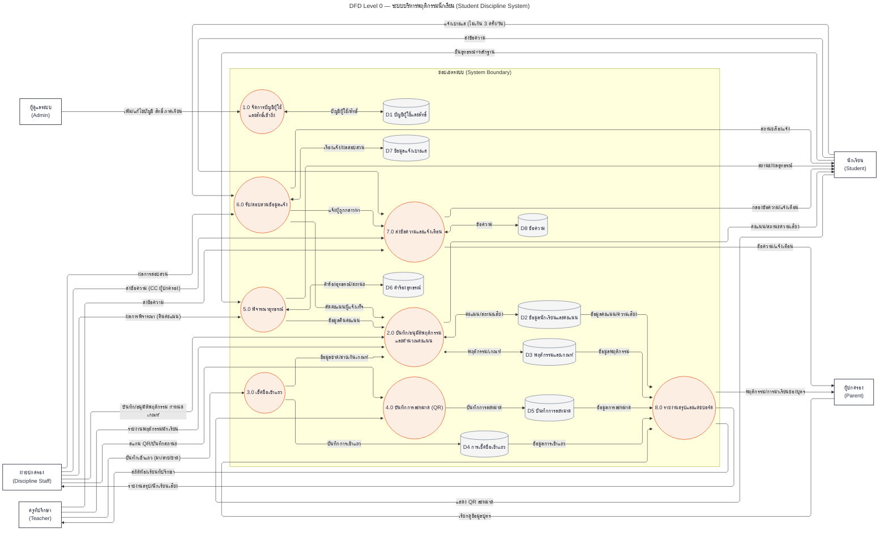

# แผน: แก้ปัญหาเส้นทับกันใน DFD Level 0 (Mermaid)

## สาเหตุของเส้นทับกัน
Mermaid จัด layout ด้วย dagre ซึ่งกับกราฟขนาด 21 โหนด / 43 เส้นแบบนี้ มีปัญหา 2 อย่าง: (1) back-edge เช่น D2→P2 (อ่านย้อนจากคลังข้อมูลกลับเข้ากระบวนการ) ทำให้เกิดวงวนแล้วเส้นไขว้กันเปะปัง (2) จำนวนเส้นมากเกินที่ dagre จะแยกให้หมด

## วิธีแก้ 3 ชั้น (ตามที่ตกลงกัน)
1. **เปิด ELK renderer** — เพิ่ม `%%{init: {"flowchart": {"defaultRenderer": "elk"}}}%%` (mermaid.live รองรับ) ELK จัดเส้นแบบ orthogonal เลี่ยงการตัดกันและเลี่ยงกล่องได้ดีกว่า dagre มาก
2. **รวมลูกศรอ่าน/เขียนคลังข้อมูลเป็นสองหัว `<-->`** 6 คู่ (P1↔D1, P2↔D2, P2↔D3, P5↔D6, P6↔D7, P7↔D8) — ลดจาก 43 → 37 เส้น และกำจัด back-edge ทั้งหมดระหว่าง process↔store
3. **ใส่ subgraph "ขอบเขตระบบ (System Boundary)"** ครอบกระบวนการ 1.0–8.0 และคลังข้อมูล D1–D8 — ตรงตามหลัก DFD และช่วย ELK จัดกลุ่มให้เส้นภายนอก/ภายในแยกกันชัด

## การตรวจสอบด้วยการวัดจริง (ตอนลงมือ)
- ติดตั้ง `@dagrejs/dagre` + `elkjs` ในโฟลเดอร์ชั่วคราว `.tmp_dfd_opt` ของ repo (ลบทิ้งเมื่อเสร็จ)
- เขียนสคริปต์ Node สร้างกราฟชุดเดียวกับผัง แล้วนับ **จำนวนจุดที่เส้นตัดกัน + เส้นทับกัน (collinear overlap) + เส้นพาดผ่านกล่อง** ของแต่ละ config: ทิศทาง LR/TB × มี/ไม่มี subgraph × dagre/elk
- เลือก config ที่คะแนนต่ำสุด (ถ้าเท่ากันเลือก TB เพราะเหมาะกับหน้า A4 แนวตั้งของรายงาน) — ทิศทางและการใช้ subgraph จึงมาจากผลวัด ไม่ใช่เดา
- เช็ค docs ของ Mermaid ยืนยัน syntax ELK ปัจจุบัน (`defaultRenderer: "elk"`)

## โครงร่างโค้ดใหม่ (ส่วนที่ตายตัว)

(หมายเหตุ: ในโค้ดจริงจะคง label ภาษาอังกฤษกำกับในโหนดแบบเดิมไว้ — ตัดออกในโครงร่างนี้เพื่อความกระชับ)

## ขั้นตอนลงมือ
1. รันการวัด layout ตามด้านบน → เลือก config ชนะ
2. อัปเดต `docs/DFD_Level0.md` ด้วยโค้ดใหม่ฉบับสมบูรณ์ (คง label ไทย+อังกฤษในโหนด)
3. ลบโฟลเดอร์ `.tmp_dfd_opt`
4. แสดงโค้ดสุดท้ายในแชท พร้อมสรุปว่าลดเส้นตัดกันไปกี่จุด

## ข้อจำกัดที่ควรรู้
Mermaid ไม่มีการลากเส้นด้วยมือ จึง**การันตี 0 จุดตัดไม่ได้** แต่คาดว่าชุดนี้ลดได้มาก (ELK + ลดเส้น + จัดกลุ่ม) ถ้าผลวัดแล้วยังรกเกินไปสำหรับใส่รายงาน ทางเลือกสุดท้ายคือแยกเป็น 2 ผัง (ผังวินัย/คะแนน และผังปฏิบัติการ/บริการ) — จะเสนอพร้อมผลวัดถ้าจำเป็น