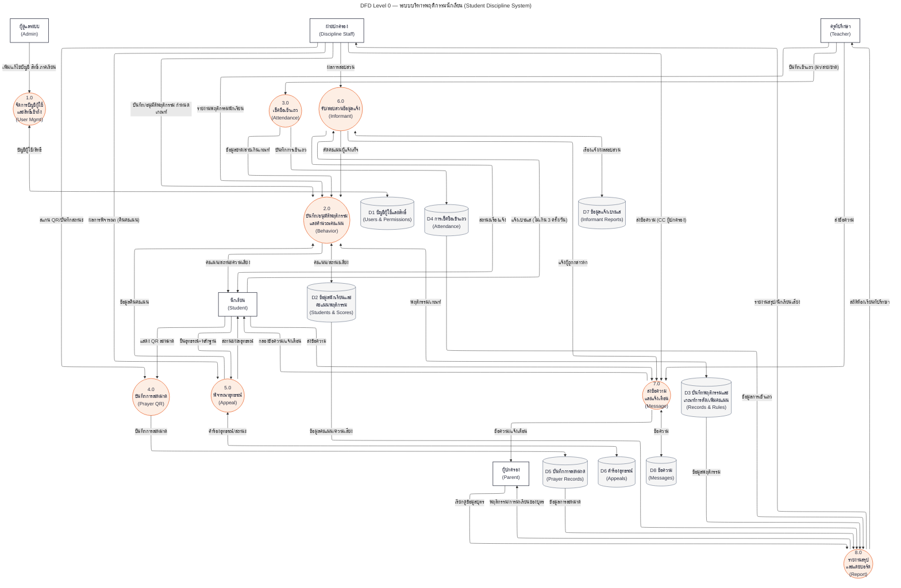

# DFD Level 0 (Diagram 0) — ระบบบริหารพฤติกรรมนักเรียน

โค้ด Mermaid สำหรับวางใน [mermaid.live](https://mermaid.live) — คัดลอกทั้งบล็อก ```mermaid ด้านล่างได้เลย

## การจัดเส้น (แก้ปัญหาเส้นทับกัน)

- **ใช้ layout engine ELK** — Mermaid v12 (ที่ mermaid.live ใช้) ใช้ ELK เป็นค่าเริ่มต้นของ flowchart อยู่แล้ว และกำกับไว้ใน frontmatter (`config: layout: elk`) ให้ชัดเจน; บรรทัด `%%{init: ...}%%` เป็น fallback สำหรับ Mermaid เวอร์ชันเก่า (v10–v11) เช่น extension ใน VS Code
- **ลูกศรอ่าน/เขียนคลังข้อมูลรวมเป็นสองหัว `<-->`** 6 คู่ (P1↔D1, P2↔D2, P2↔D3, P5↔D6, P6↔D7, P7↔D8) — ลดจาก 43 → 37 เส้น และกำจัดเส้นย้อนกลับ
- **วางแนวตั้ง (`flowchart TB`)** — ผลวัดจริงด้วย engine ตัวเดียวกับ Mermaid: ลดจุดที่เส้นตัดกันจาก 30 → 16 จุด ไม่มีเส้นทับซ้อนกันเอง และไม่มีเส้นพาดผ่านกล่องใด ๆ (เทียบทางเลือกอื่นแล้วชุดนี้ต่ำสุด)
- ทิศทางเปลี่ยนเป็นแนวนอนได้: แก้ `flowchart TB` → `flowchart LR`



## ข้อจำกัด

Mermaid จัดเส้นอัตโนมัติทั้งหมด ไม่สามารถลากเส้นเองได้ จึงไม่สามารถการันตี 0 จุดตัดได้ — 16 จุดที่เหลือเป็นผลจากความหนาแน่นของกราฟ (โดยเฉพาะเส้นจากคลังข้อมูล D2–D5 เข้ากระบวนการ 8.0) ซึ่งน้อยที่สุดแล้วเทียบกับทุกทางเลือกที่วัดได้ ถ้าต้องการผังสำหรับพิมพ์ที่เส้นตัดกันน้อยกว่านี้ ทางเลือกคือแยกเป็น 2 ผังย่อย (ผังวินัย/คะแนน: 2.0, 5.0, 6.0 และผังปฏิบัติการ: 1.0, 3.0, 4.0, 7.0, 8.0)
