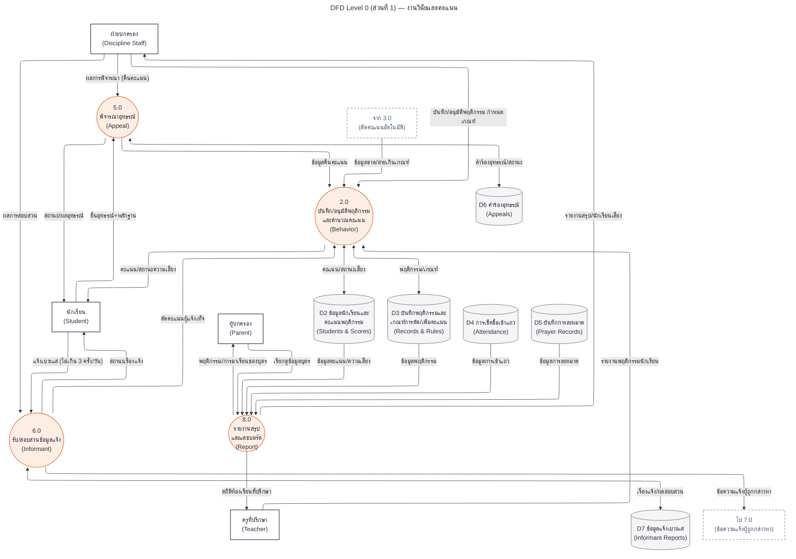
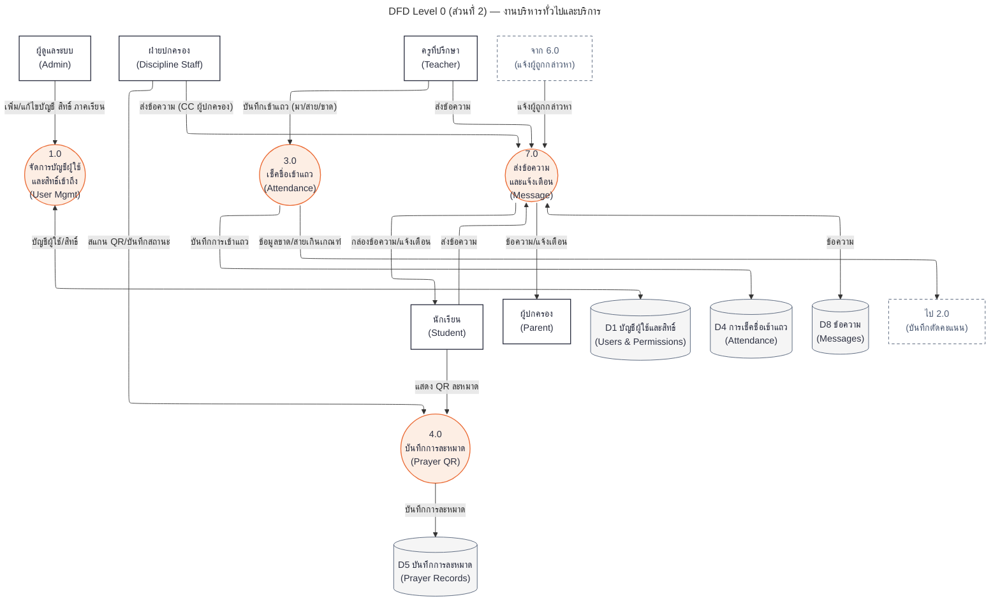
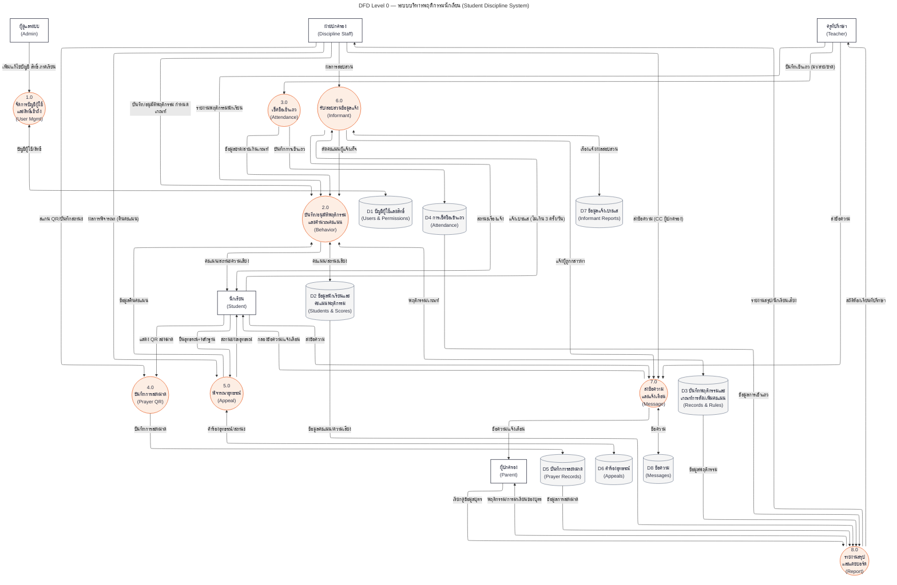

# DFD Level 0 (Diagram 0) — ระบบบริหารพฤติกรรมนักเรียน

โค้ด Mermaid สำหรับวางใน [mermaid.live](https://mermaid.live) มี 2 แบบให้เลือกใช้:

- **แบบที่ 1 (แนะนำ): แยกเป็น 2 ผัง** — ผังส่วนที่ 1 ไม่มีเส้นตัดกันเลย (0 จุด) ผังส่วนที่ 2 เหลือ 1 จุด รวมทั้งระบบมีเส้นตัดกันแค่ 1 จุด (วัดจริงด้วย layout engine ELK ตัวเดียวกับที่ Mermaid ใช้) เหมาะกับใส่รายงาน
- **แบบที่ 2: ผังเดียวทั้งระบบ** — เห็นภาพรวมในหน้าเดียว แต่ยังมีเส้นตัดกัน 16 จุด (เป็นค่าต่ำสุดของกราฟขนาดนี้เมื่อจัดด้วยเครื่องอัตโนมัติ ทดสอบแล้ว 14 แบบ config)

ทั้งสองแบบมีเนื้อหาชุดข้อมูลเดียวกัน (กระบวนการ 1.0–8.0, คลังข้อมูล D1–D8, หน่วยงานภายนอก 5 หน่วย) — แบบแยกเพียงจัดกลุ่มใหม่เพื่อความสะอาด โดยมีโหนดเส้นประ "จาก/ไป" คู่กันระหว่างสองผัง เพื่อให้เส้นทางไหลข้ามส่วนยังครบถ้วน

---

# แบบที่ 1 (แนะนำ): แยกเป็น 2 ผัง

## ผังส่วนที่ 1 — งานวินัยและคะแนน (0 จุดตัด)

ครอบคลุม: 2.0 พฤติกรรม/คะแนน, 5.0 อุทธรณ์, 6.0 ข้อมูลแจ้งเบาะแส, 8.0 รายงานสรุป

## ผังส่วนที่ 2 — งานบริหารทั่วไปและบริการ (1 จุดตัด)

ครอบคลุม: 1.0 บัญชีผู้ใช้/สิทธิ์, 3.0 เช็คชื่อเข้าแถว, 4.0 ละหมาด QR, 7.0 ข้อความ/แจ้งเตือน

### หมายเหตุของแบบแยก

- โหนดเส้นประเชื่อมคู่กันข้ามสองผัง: "ไป 2.0" (ผังส่วนที่ 2) ↔ "จาก 3.0" (ผังส่วนที่ 1) และ "ไป 7.0" (ผังส่วนที่ 1) ↔ "จาก 6.0" (ผังส่วนที่ 2) — เป็นเส้นทางไหลเดียวกันที่พาดผ่านสองส่วน
- คลังข้อมูล **D4 การเช็คชื่อ** และ **D5 การละหมาด** ปรากฏในทั้งสองผัง เพราะถูก**เขียน**โดยกระบวนการในส่วนที่ 2 (3.0, 4.0) แต่ถูก**อ่าน**เพื่อทำรายงานโดย 8.0 ในส่วนที่ 1
- จุดตัดเดียวที่เหลือในผังส่วนที่ 2 (แสดง QR ↔ ส่งข้อความ) บังคับโดยโครงสร้างกราฟ ทดสอบ 8 วิธีแล้วไม่มีวิธีใดกำจัดได้

---

# แบบที่ 2: ผังเดียวทั้งระบบ (16 จุดตัด)

## ข้อจำกัดร่วม

Mermaid จัดเส้นอัตโนมัติทั้งหมด ไม่สามารถลากเส้นเองได้ จำนวนจุดตัดข้างต้นเป็นค่าต่ำสุดที่วัดได้จากการทดสอบหลายสิบ config (dagre/ELK × LR/TB × มี/ไม่มี subgraph × invisible edges) ด้วย engine เดียวกับที่ Mermaid ใช้จริง
