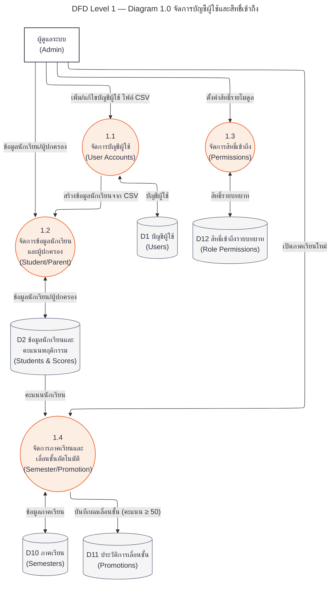
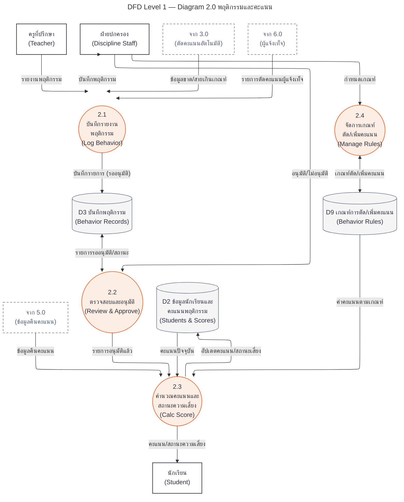
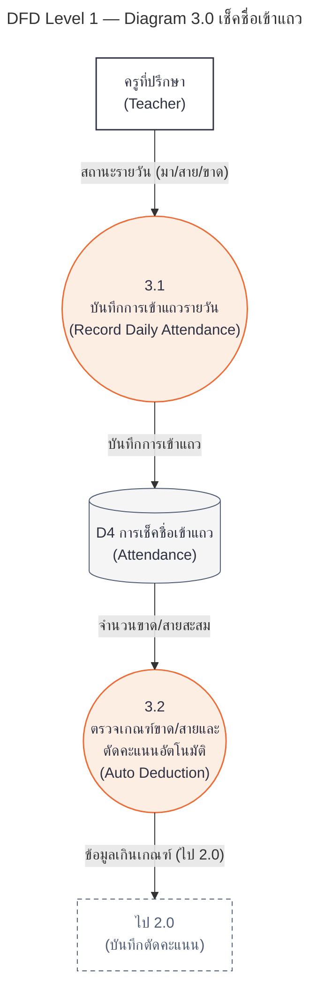
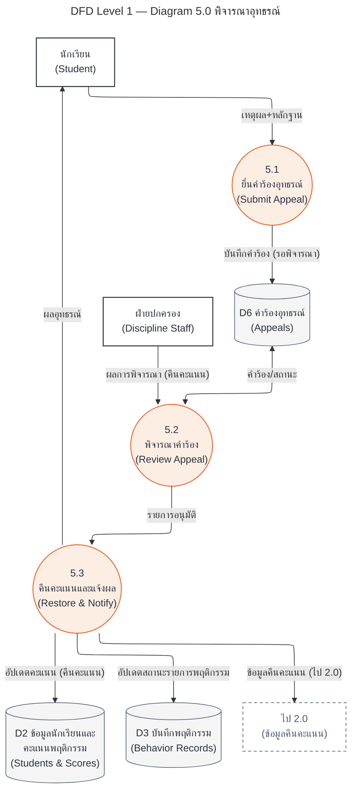
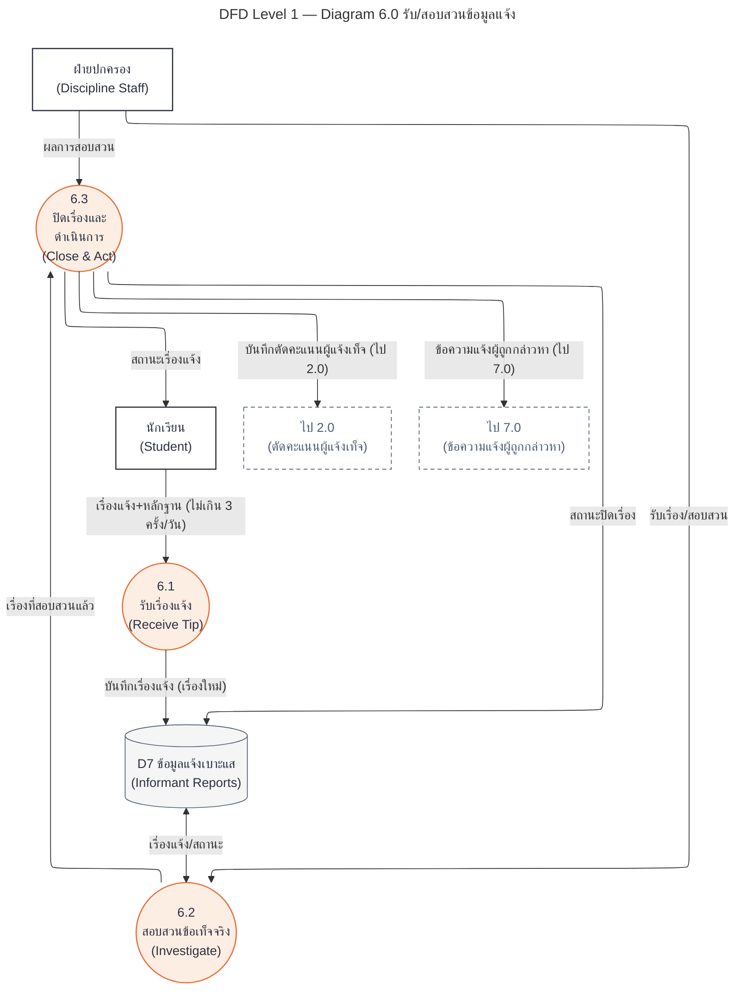
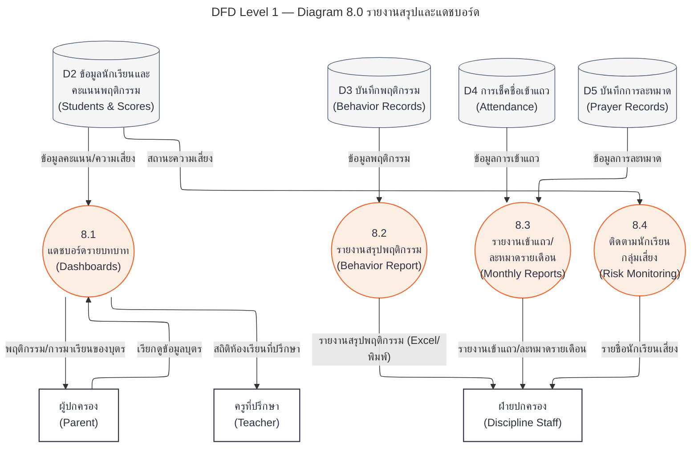

# DFD Level 1 — ระบบบริหารพฤติกรรมนักเรียน

แตกกระบวนการย่อยจาก DFD Level 0 (ดู [DFD_Level0.md](DFD_Level0.md)) ออกเป็น sub-process — โค้ด Mermaid สำหรับวางใน [mermaid.live](https://mermaid.live) แต่ละผังอยู่ในบล็อก ```mermaid แยกกัน

## ขอบเขต

- **แตก 6 กระบวนการ:** 1.0 บัญชี/สิทธิ์, 2.0 พฤติกรรม/คะแนน, 3.0 เช็คชื่อ, 5.0 อุทธรณ์, 6.0 ข้อมูลแจ้ง, 8.0 รายงาน
- **ไม่แตก 2 กระบวนการ:** 4.0 ละหมาด QR และ 7.0 ข้อความ (primitive — มีขั้นตอนเดียว ตามหลัก DFD ไม่ต้องแตกต่อ)
- ใช้ layout ELK และสไตล์เดียวกับ Level 0 (กระบวนการ = วงกลม, หน่วยงานภายนอก = สี่เหลี่ยม, คลังข้อมูล = ทรงกระบอก, ลูกศรอ่าน/เขียน = สองหัว)
- โหนดเส้นประ เช่น "จาก 3.0" / "ไป 2.0" คือเส้นทางไหลที่เชื่อมไปยังกระบวนการอื่น — คงไว้ให้สอดคล้องกับ Level 0 (balancing)

## ทะเบียนคลังข้อมูล (D1–D12)

| คลัง | ตารางจริง | ที่มา |
|---|---|---|
| D1 บัญชีผู้ใช้ | users | Level 0 |
| D2 ข้อมูลนักเรียนและคะแนน | students | Level 0 |
| D3 บันทึกพฤติกรรม | behavior_records | Level 0 (ระดับ 1 แยกเกณฑ์ออกเป็น D9) |
| D4 การเช็คชื่อเข้าแถว | attendances | Level 0 |
| D5 บันทึกการละหมาด | prayer_records | Level 0 |
| D6 คำร้องอุทธรณ์ | appeals | Level 0 |
| D7 ข้อมูลแจ้งเบาะแส | informant_reports | Level 0 |
| D8 ข้อความ | messages | Level 0 |
| D9 เกณฑ์การตัด/เพิ่มคะแนน | behavior_rules | เพิ่มใหม่ |
| D10 ภาคเรียน | semesters | เพิ่มใหม่ |
| D11 ประวัติการเลื่อนชั้น | student_promotions | เพิ่มใหม่ |
| D12 สิทธิ์เข้าถึงรายบทบาท | role_permissions | เพิ่มใหม่ |

---

## ผัง 1: แตกกระบวนการ 1.0 จัดการบัญชีผู้ใช้และสิทธิ์เข้าถึง



## ผัง 2: แตกกระบวนการ 2.0 บันทึก/อนุมัติพฤติกรรมและคำนวณคะแนน



## ผัง 3: แตกกระบวนการ 3.0 เช็คชื่อเข้าแถว



## ผัง 4: แตกกระบวนการ 5.0 พิจารณาอุทธรณ์



## ผัง 5: แตกกระบวนการ 6.0 รับ/สอบสวนข้อมูลแจ้ง



## ผัง 6: แตกกระบวนการ 8.0 รายงานสรุปและแดชบอร์ด


