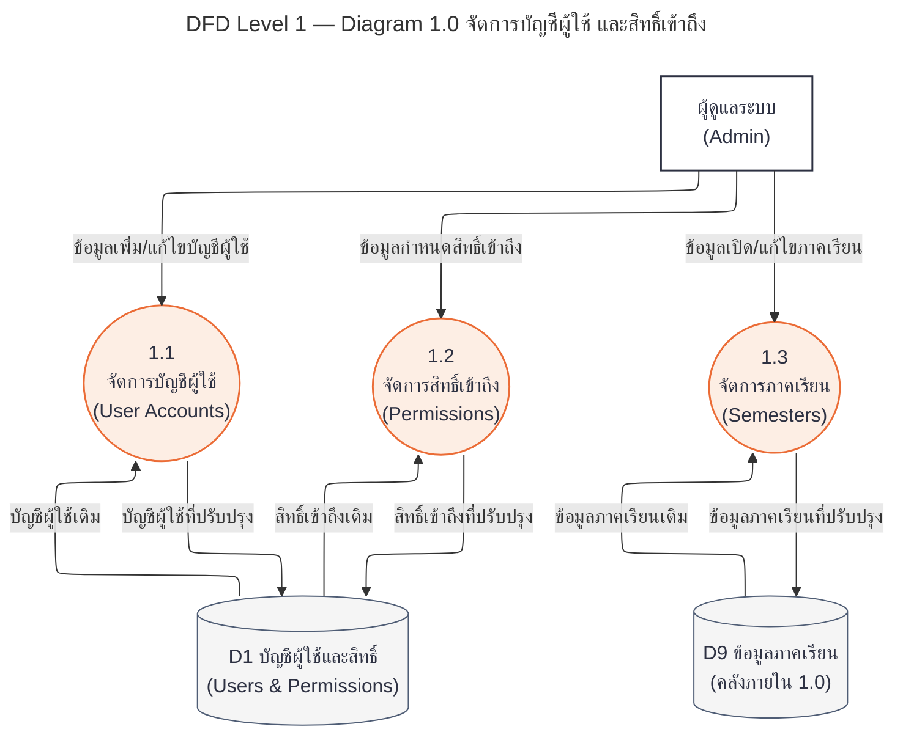
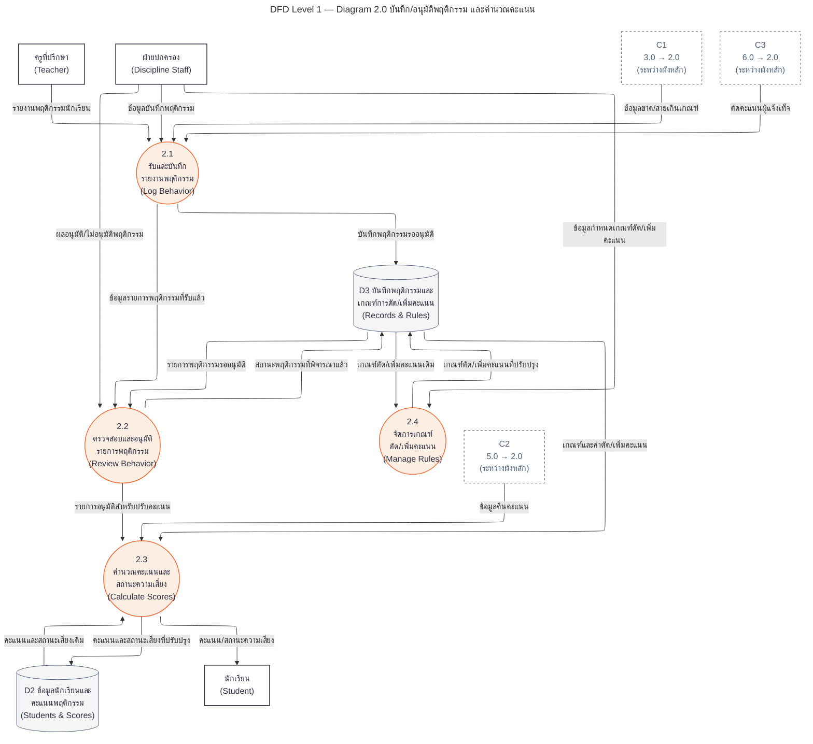
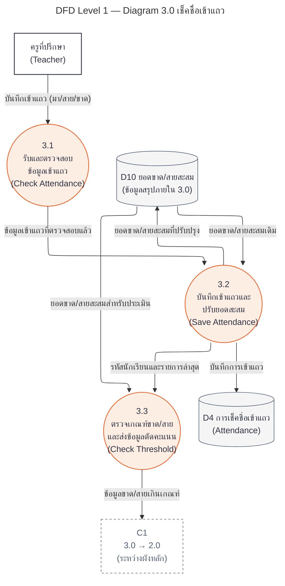
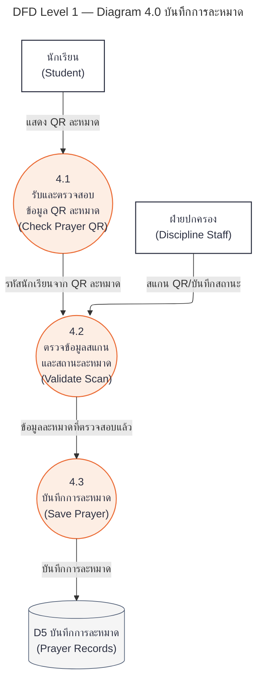
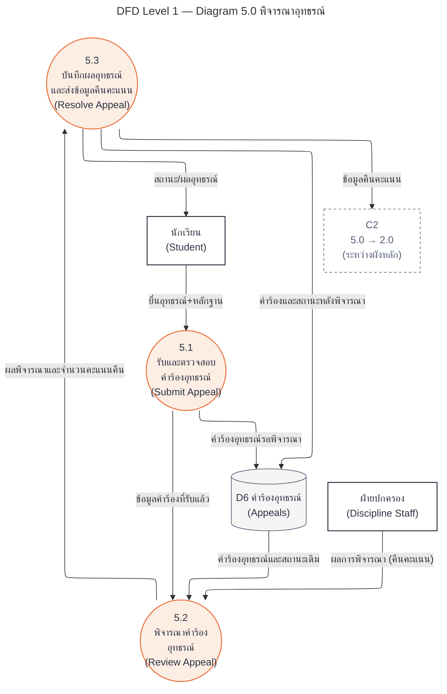
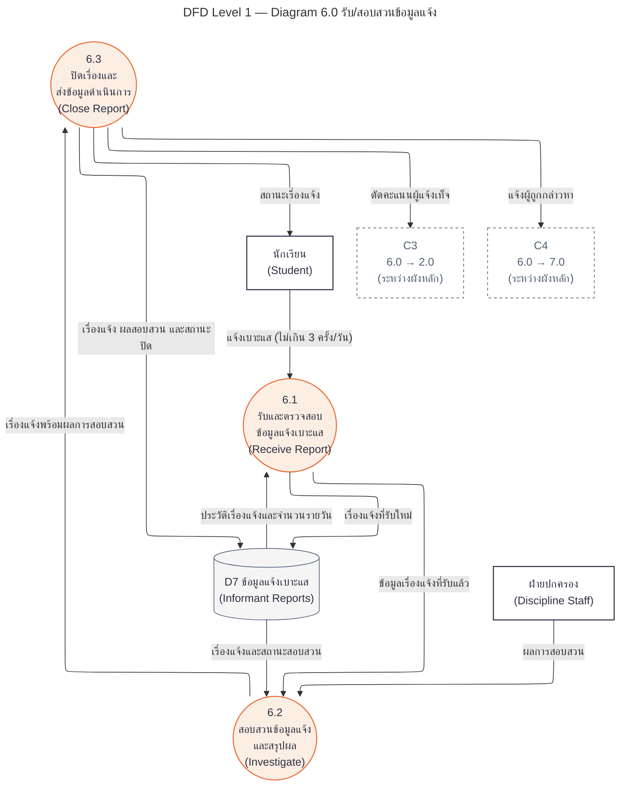
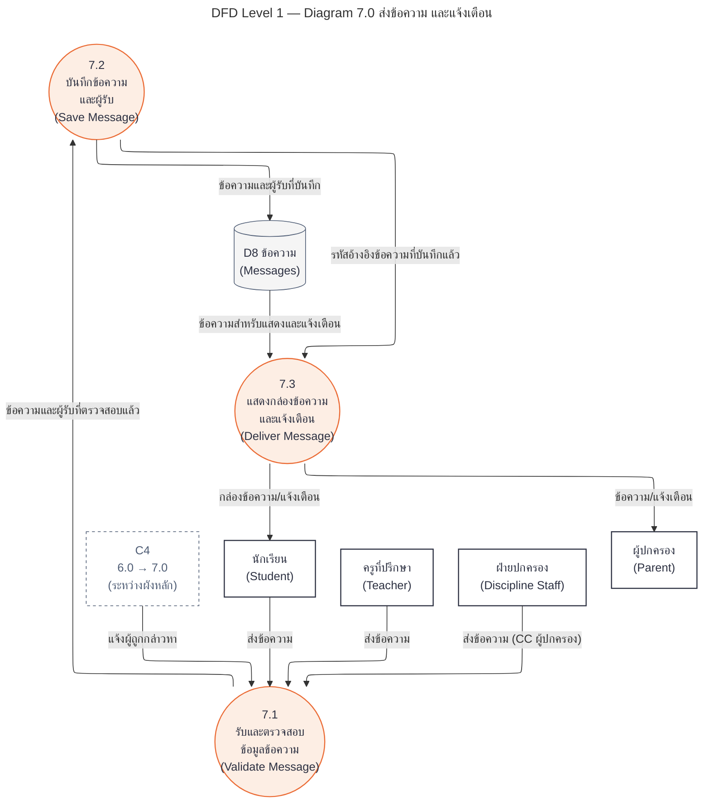
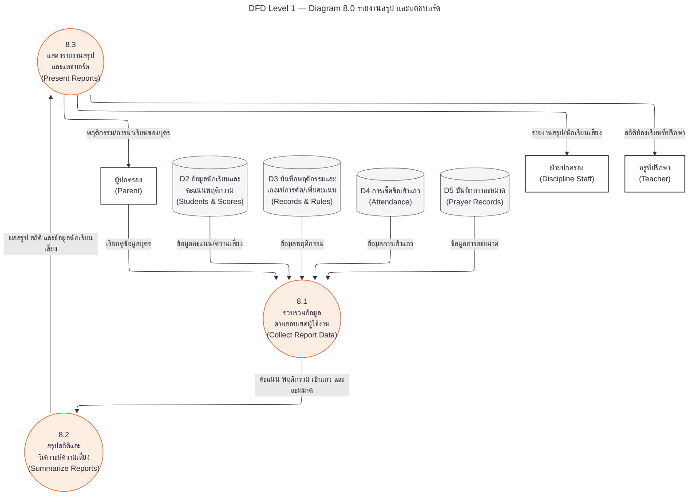

# DFD Level 1 — ระบบบริหารพฤติกรรมนักเรียน

แตกจาก Mermaid Level 0 ที่ผู้ใช้ให้ ครบทั้ง 8 กระบวนการหลัก รวม 25 กระบวนการย่อย

ไฟล์ HTML จัดเส้นด้วยพิกัด SVG และตรวจว่าไม่มีเส้นทับ/ตัดกัน ส่วน Mermaid เป็นต้นฉบับสำหรับแก้ไข การจัดเส้นของ Mermaid ขึ้นกับ renderer

D9 ภาคเรียนและ D10 ยอดขาด/สายสะสมเป็นข้อมูลภายในผัง 1.0 และ 3.0; D10 เป็นข้อมูลสรุปเชิงตรรกะจากการเข้าแถว ไม่ได้เพิ่มตารางฐานข้อมูล

C1–C4 คงการเชื่อมระหว่างกระบวนการหลักตาม Level 0 ส่วน Lx-y ใน HTML คือจุดต่อเส้นระหว่างกระบวนการย่อยในผังเดียวกัน

## ผัง 1.0 จัดการบัญชีผู้ใช้ และสิทธิ์เข้าถึง

## ผัง 2.0 บันทึก/อนุมัติพฤติกรรม และคำนวณคะแนน

## ผัง 3.0 เช็คชื่อเข้าแถว

## ผัง 4.0 บันทึกการละหมาด

## ผัง 5.0 พิจารณาอุทธรณ์

## ผัง 6.0 รับ/สอบสวนข้อมูลแจ้ง

## ผัง 7.0 ส่งข้อความ และแจ้งเตือน

## ผัง 8.0 รายงานสรุป และแดชบอร์ด

