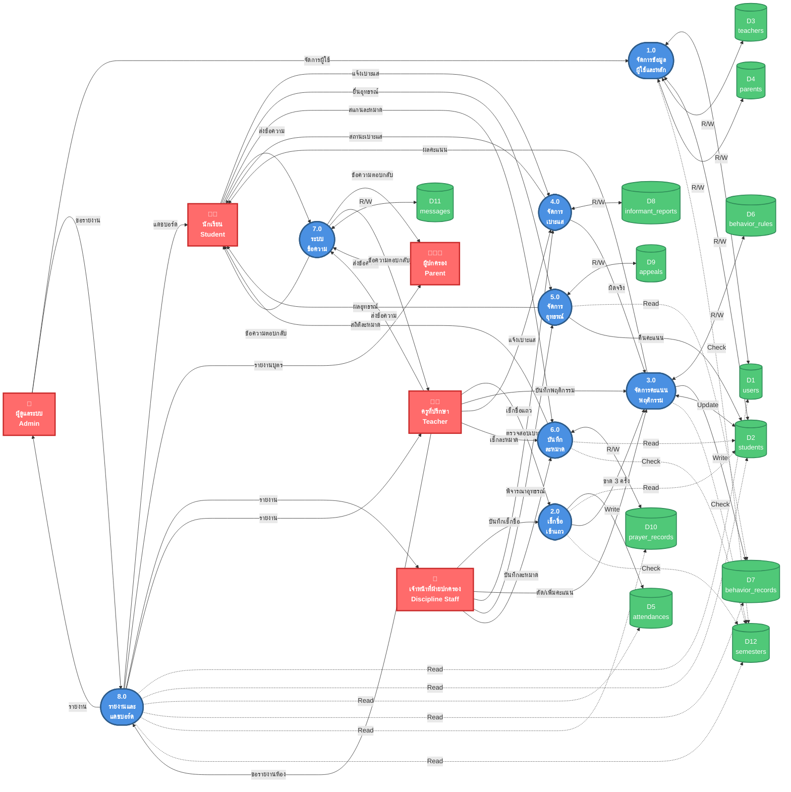

# DFD Level 1 - เวอร์ชันเส้นไม่ทับกัน (Clean Version)
## ระบบสารสนเทศบริหารงานวินัยและติดตามพฤติกรรมนักเรียน

---

## แผนภาพ DFD Level 1 (Left-Right Layout)

---

## ข้อจำกัดของ Mermaid

Mermaid มีข้อจำกัดในการควบคุมตำแหน่งอย่างละเอียด ถ้าเส้นยังทับกันอยู่ แนะนำให้ใช้เครื่องมือเหล่านี้แทน:

### 🎨 เครื่องมือแนะนำสำหรับวาด DFD (ไม่มีเส้นทับกัน)

1. **Draw.io (diagrams.net)** ⭐ แนะนำสูงสุด
   - ฟรี 100%
   - ควบคุม waypoint ได้เอง
   - มี DFD shapes สำเร็จรูป
   - https://app.diagrams.net

2. **Lucidchart**
   - Auto-routing ดีมาก
   - Template DFD สำเร็จรูป
   - https://lucidchart.com

3. **Visual Paradigm Online**
   - มี DFD Level 0, 1, 2 templates
   - Auto-align ฉลาด
   - https://online.visual-paradigm.com

---

## ทางเลือก: ใช้ไฟล์ Draw.io Template

ฉันแนะนำให้ใช้ Draw.io เพราะ:
- ✅ ฟรีและใช้งานง่าย
- ✅ ลากเส้นเองได้ 100%
- ✅ Export PNG/SVG/PDF คุณภาพสูง
- ✅ มี DFD symbols มาตรฐาน

คุณต้องการให้ฉัน:
1. สร้างไฟล์ Draw.io (.drawio) พร้อม template DFD นี้ไหม?
2. หรือสร้างแผนภาพแบบ manual เป็นรูปภาพ SVG?
