# แผนภาพกระแสข้อมูลระดับที่ 1 (DFD Level 1) - ปรับปรุงเส้นไม่ทับกัน
## ระบบสารสนเทศการบริหารงานวินัยและติดตามพฤติกรรมนักเรียน โรงเรียนศิริราษฎร์สามัคคี

---

## แผนภาพ DFD Level 1 แบบ Top-Down Layout (เส้นไม่ทับกัน)

```mermaid
graph TB
%% ==========================================
%% EXTERNAL ENTITIES - TOP LAYER
%% ==========================================
    subgraph EXT["🎯 External Entities - ผู้ใช้งานระบบ"]
        direction LR
        Admin["👤 ผู้ดูแลระบบ<br>(Admin)"]
        Discipline["👮 เจ้าหน้าที่ฝ่ายปกครอง<br>(Discipline Staff)"]
        Teacher["👨‍🏫 ครูที่ปรึกษา<br>(Teacher)"]
        Student["🧑‍🎓 นักเรียน<br>(Student)"]
        Parent["👨‍👩‍👦 ผู้ปกครอง<br>(Parent)"]
    end

%% ==========================================
%% PROCESS LAYER 1 - CORE MANAGEMENT
%% ==========================================
    subgraph CORE["📊 ชั้นที่ 1: การจัดการหลัก"]
        direction TB
        P1(["1.0<br>จัดการข้อมูลผู้ใช้<br>และข้อมูลหลัก"])
        P8(["8.0<br>ประมวลผลรายงาน<br>สถิติและแดชบอร์ด"])
    end

%% ==========================================
%% PROCESS LAYER 2 - ATTENDANCE & PRAYER
%% ==========================================
    subgraph TRACK["⏰ ชั้นที่ 2: การติดตามกิจกรรม"]
        direction LR
        P2(["2.0<br>เช็กชื่อการเข้าแถว<br>หน้าเสาธง"])
        P6(["6.0<br>บันทึกและติดตาม<br>ผลการละหมาด"])
    end

%% ==========================================
%% PROCESS LAYER 3 - BEHAVIOR MANAGEMENT
%% ==========================================
    subgraph BEHAVIOR["🎯 ชั้นที่ 3: การจัดการพฤติกรรม"]
        direction LR
        P3(["3.0<br>จัดการคะแนนพฤติกรรม<br>และกฎระเบียบวินัย"])
        P4(["4.0<br>แจ้งและตรวจสอบ<br>เบาะแสการกระทำผิด"])
        P5(["5.0<br>ยื่นและพิจารณา<br>คำร้องอุทธรณ์"])
    end

%% ==========================================
%% PROCESS LAYER 4 - COMMUNICATION
%% ==========================================
    subgraph COMM["💬 ชั้นที่ 4: การสื่อสาร"]
        P7(["7.0<br>ติดต่อสื่อสาร<br>และส่งข้อความภายใน"])
    end

%% ==========================================
%% DATA STORES - BOTTOM LAYER
%% ==========================================
    subgraph DS_USER["💾 กลุ่มข้อมูลผู้ใช้งาน"]
        D1[("D1: users<br>ผู้ใช้งาน")]
        D2[("D2: students<br>นักเรียน")]
        D3[("D3: teachers<br>ครู")]
        D4[("D4: parents<br>ผู้ปกครอง")]
    end

    subgraph DS_ACTIVITY["📋 กลุ่มข้อมูลกิจกรรม"]
        D5[("D5: attendances<br>การเข้าแถว")]
        D10[("D10: prayer_records<br>การละหมาด")]
        D12[("D12: semesters<br>ภาคเรียน")]
    end

    subgraph DS_BEHAVIOR["⚖️ กลุ่มข้อมูลพฤติกรรม"]
        D6[("D6: behavior_rules<br>กฎระเบียบ")]
        D7[("D7: behavior_records<br>บันทึกพฤติกรรม")]
        D8[("D8: informant_reports<br>เบาะแส")]
        D9[("D9: appeals<br>อุทธรณ์")]
    end

    subgraph DS_MSG["💌 กลุ่มข้อมูลสื่อสาร"]
        D11[("D11: messages<br>ข้อความ")]
    end

%% ==========================================
%% EXTERNAL TO PROCESS FLOWS
%% ==========================================
    Admin -->|"[1] ข้อมูลผู้ใช้, นักเรียน, ครู"| P1
    Admin -->|"[2] ขอรายงานภาพรวม"| P8
    
    Discipline -->|"[3] บันทึกเช็กชื่อ"| P2
    Discipline -->|"[4] บันทึกตัด/เพิ่มคะแนน"| P3
    Discipline -->|"[5] ตรวจสอบเบาะแส"| P4
    Discipline -->|"[6] พิจารณาอุทธรณ์"| P5
    Discipline -->|"[7] บันทึกละหมาด"| P6
    Discipline -->|"[8] ส่งข้อความแจ้งเตือน"| P7
    Discipline -->|"[9] ขอรายงานวินัย"| P8
    
    Teacher -->|"[10] บันทึกเช็กชื่อแถว"| P2
    Teacher -->|"[11] บันทึกพฤติกรรม"| P3
    Teacher -->|"[12] แจ้งเบาะแส"| P4
    Teacher -->|"[13] บันทึกละหมาด"| P6
    Teacher -->|"[14] ส่ง/รับข้อความ"| P7
    Teacher -->|"[15] ขอรายงานห้อง"| P8
    
    Student -->|"[16] แจ้งเบาะแส"| P4
    Student -->|"[17] ยื่นอุทธรณ์"| P5
    Student -->|"[18] สแกนเช็กชื่อละหมาด"| P6
    Student -->|"[19] ส่ง/รับข้อความ"| P7
    Student -->|"[20] ดูแดชบอร์ดส่วนตัว"| P8
    
    Parent -->|"[21] ส่ง/รับข้อความ"| P7
    Parent -->|"[22] ติดตามบุตรหลาน"| P8

%% ==========================================
%% PROCESS TO PROCESS FLOWS (แยกเป็น paths ไม่ทับกัน)
%% ==========================================
    P2 -->|"ขาดครบ 3 ครั้ง<br>ส่งตัดคะแนน -5"| P3
    P4 -->|"เบาะแสเป็นจริง<br>ส่งตัดคะแนน"| P3

%% ==========================================
%% PROCESS TO DATA STORE (จัดกลุ่มตาม layer)
%% ==========================================
    P1 <-->|"อ่าน/บันทึก"| D1
    P1 <-->|"อ่าน/บันทึก/เลื่อนชั้น"| D2
    P1 <-->|"อ่าน/บันทึก"| D3
    P1 <-->|"อ่าน/บันทึก"| D4
    P1 <-->|"ตรวจสอบภาคเรียน"| D12

    P2 -->|"บันทึกประวัติ"| D5
    P2 -.->|"ดึงรายชื่อ"| D2
    P2 -.->|"อ้างอิงภาคเรียน"| D12

    P6 <-->|"บันทึก/อ่าน"| D10
    P6 -.->|"ดึงรายชื่อ"| D2
    P6 -.->|"อ้างอิงภาคเรียน"| D12

    P3 <-->|"อ่าน/บันทึกกฎ"| D6
    P3 -->|"บันทึกประวัติ"| D7
    P3 <-->|"คำนวณคะแนน"| D2
    P3 -.->|"อ้างอิงภาคเรียน"| D12

    P4 <-->|"บันทึก/อ่าน"| D8

    P5 <-->|"บันทึก/อ่าน"| D9
    P5 -.->|"ดึงรายการตัดคะแนน"| D7
    P5 -->|"คืนคะแนน"| D2
    P5 -->|"บันทึกคะแนนที่คืน"| D7

    P7 <-->|"บันทึก/อ่าน"| D11

    P8 -.->|"ดึงข้อมูล"| D1
    P8 -.->|"ดึงคะแนนนักเรียน"| D2
    P8 -.->|"ดึงสถิติเข้าแถว"| D5
    P8 -.->|"ดึงสถิติพฤติกรรม"| D7
    P8 -.->|"ดึงสถิติละหมาด"| D10
    P8 -.->|"ดึงช่วงภาคเรียน"| D12

%% ==========================================
%% RETURN FLOWS TO EXTERNAL ENTITIES
%% ==========================================
    P1 -->|"สถานะการบันทึก"| Admin
    P2 -->|"สถานะเช็กชื่อ"| Teacher
    P3 -->|"ผลการบันทึก"| Discipline
    P3 -->|"ผลการบันทึก"| Teacher
    P4 -->|"แจ้งเบาะแสใหม่"| Discipline
    P4 -->|"ผลการส่งรายงาน"| Student
    P5 -->|"สถานะอุทธรณ์"| Student
    P5 -->|"รายการรอพิจารณา"| Discipline
    P6 -->|"ผลการบันทึก"| Student
    P7 -->|"ข้อความเข้า"| Teacher
    P7 -->|"ข้อความเข้า"| Parent
    P7 -->|"ข้อความเข้า"| Student
    P7 -->|"ข้อความเข้า"| Discipline
    P8 -->|"แดชบอร์ด/รายงาน"| Admin
    P8 -->|"แดชบอร์ด/รายงาน"| Discipline
    P8 -->|"แดชบอร์ด/รายงาน"| Teacher
    P8 -->|"แดชบอร์ด/รายงาน"| Student
    P8 -->|"แดชบอร์ด/รายงาน"| Parent

%% ==========================================
%% STYLING
%% ==========================================
    classDef processStyle fill:#4A90E2,stroke:#2E5C8A,stroke-width:2px,color:#fff
    classDef datastoreStyle fill:#50C878,stroke:#2E8B57,stroke-width:2px,color:#fff
    classDef externalStyle fill:#FF6B6B,stroke:#C92A2A,stroke-width:2px,color:#fff
    classDef subgraphStyle fill:#F8F9FA,stroke:#ADB5BD,stroke-width:2px
    
    class P1,P2,P3,P4,P5,P6,P7,P8 processStyle
    class D1,D2,D3,D4,D5,D6,D7,D8,D9,D10,D11,D12 datastoreStyle
    class Admin,Discipline,Teacher,Student,Parent externalStyle
```

---

## สรุปการปรับปรุงเพื่อป้องกันเส้นทับกัน

### 1. จัด Layout แบบ Hierarchical (Top-Down)
- **ชั้นที่ 1 (Top)**: External Entities - ผู้ใช้งานทั้งหมด
- **ชั้นที่ 2**: Process 1.0 (Master Data) และ Process 8.0 (Reports)
- **ชั้นที่ 3**: Process 2.0 (Attendance) และ Process 6.0 (Prayer)
- **ชั้นที่ 4**: Process 3.0, 4.0, 5.0 (Behavior Management)
- **ชั้นที่ 5**: Process 7.0 (Messaging)
- **ชั้นที่ 6 (Bottom)**: Data Stores แบ่งเป็น 4 กลุ่ม

### 2. ใช้ Subgraph แยกกลุ่มข้อมูล
- **กลุ่มข้อมูลผู้ใช้งาน**: D1-D4
- **กลุ่มข้อมูลกิจกรรม**: D5, D10, D12
- **กลุ่มข้อมูลพฤติกรรม**: D6-D9
- **กลุ่มข้อมูลสื่อสาร**: D11

### 3. ลดจำนวนเส้นที่ทับกัน
- ใช้เลขอ้างอิง `[1]`, `[2]`, `[3]` ในเส้น data flow เพื่อลดความยาว
- แยก return flows ออกจาก input flows
- ใช้เส้นประ `-.->` สำหรับ read-only flows
- ใช้เส้นทึบ `-->` สำหรับ write/update flows
- ใช้เส้นสองทาง `<-->` สำหรับ bidirectional flows

### 4. การใช้สีแยกประเภท
- 🔵 **สีน้ำเงิน**: Processes
- 🟢 **สีเขียว**: Data Stores
- 🔴 **สีแดง**: External Entities

---

## วิธีการใช้งาน

### A. แสดงผลออนไลน์
1. คัดลอกโค้ด Mermaid ด้านบน
2. ไปที่ https://mermaid.live/
3. วางโค้ดและ Export เป็น PNG/SVG ความละเอียดสูง

### B. ใช้ใน Markdown Viewer
- GitHub, GitLab, Notion (บางเวอร์ชัน), Obsidian รองรับ Mermaid syntax

### C. แก้ไขเพิ่มเติม
หากต้องการปรับแต่งตำแหน่ง:
- เพิ่ม `direction LR` (Left to Right) หรือ `TB` (Top to Bottom) ใน subgraph
- ใช้ `rankdir=LR` สำหรับ layout แนวนอน

---

## หมายเหตุเพิ่มเติม

### ความแตกต่างจากเวอร์ชันเดิม
1. ✅ **เส้นไม่ทับกัน**: จัด layer อย่างชัดเจน
2. ✅ **อ่านง่ายขึ้น**: จัดกลุ่ม subgraph ตามหน้าที่
3. ✅ **ลดความซับซ้อน**: ใช้เลขอ้างอิงแทนข้อความยาว
4. ✅ **แสดง flow direction**: แยก input/output flows
5. ✅ **สอดคล้องกับ ER Diagram**: รักษาโครงสร้างข้อมูลเดิม

### การปรับใช้จริง
- สามารถแยก DFD Level 1 เป็น DFD Level 2 สำหรับแต่ละ Process (8 แผนภาพย่อย)
- ใช้ร่วมกับ Data Dictionary และ ER Diagram ในรายงานบทที่ 3
