# Entity-Relationship Diagram (ERD) - โครงสร้างระบบฐานข้อมูล

ไฟล์เอกสารนี้บรรจุโค้ดของ Mermaid.js สำหรับนำไปใช้งานวาดแผนภาพความสัมพันธ์ของระบบฐานข้อมูล (E-R Diagram) บนเว็บไซต์ [mermaid.live](https://mermaid.live/)

---

## โค้ด E-R Diagram (คัดลอกส่วนนี้ไปใส่ใน mermaid.live)

```mermaid
erDiagram
    users {
        varchar_36 UserID PK "รหัสผู้ใช้ประจำตัว UUID"
        varchar_50 Username UK "รหัสประจำตัว/ล็อกอิน"
        varchar_60 Password "รหัสผ่านเข้ารหัสลับ"
        varchar_13 CitizenID UK "รหัสบัตรประชาชน"
        varchar_50 FirstName "ชื่อจริง TH"
        varchar_50 LastName "นามสกุล TH"
        varchar_50 FirstName_EN "ชื่อจริง EN"
        varchar_50 LastName_EN "นามสกุล EN"
        varchar_50 Role "บทบาทผู้ใช้งาน"
        varchar_100 Email UK "อีเมลกู้รหัส"
        varchar_10 Phone "เบอร์โทรศัพท์"
        varchar_50 Status "สถานะบัญชี"
        varchar_255 AdditionalInfo "ข้อมูลบันทึกย่อ"
    }

    students {
        varchar_10 StudentID PK "รหัสนักเรียน"
        varchar_36 UserID FK "รหัสผู้ใช้ล็อกอิน"
        varchar_36 ParentID FK "รหัสผู้ปกครอง"
        varchar_50 FirstName "ชื่อจริง TH"
        varchar_50 LastName "นามสกุล TH"
        varchar_50 FirstName_EN "ชื่อจริง EN"
        varchar_50 LastName_EN "นามสกุล EN"
        varchar_10 Gender "เพศนักเรียน"
        varchar_255 Photo "รูปโปรไฟล์นักเรียน"
        varchar_10 GradeLevel "ระดับชั้น"
        varchar_10 Classroom "ห้องเรียน"
        integer BehaviorScore "คะแนนความประพฤติ"
        varchar_50 RiskStatus "สถานะความเสี่ยง"
    }

    parents {
        varchar_36 ParentID PK "รหัสผู้ปกครอง UUID"
        varchar_36 UserID FK "รหัสผู้ใช้ล็อกอิน"
        varchar_10 StudentID FK "รหัสนักเรียน"
        tinyint Relationship "ความสัมพันธ์ (1=พ่อ, 2=แม่, 3=ญาติ)"
        varchar_50 FirstName "ชื่อจริง TH"
        varchar_50 LastName "นามสกุล TH"
        varchar_50 FirstName_EN "ชื่อจริง EN"
        varchar_50 LastName_EN "นามสกุล EN"
        varchar_13 CitizenID UK "รหัสบัตรประชาชน"
        varchar_10 Phone "เบอร์โทรผู้ปกครอง"
        varchar_100 Email "อีเมลติดต่อ"
        text Address "ที่อยู่ปัจจุบัน"
    }

    departments {
        bigint department_id PK "รหัสกลุ่มสาระ"
        varchar_100 name UK "ชื่อกลุ่มสาระเต็ม"
        varchar_50 short_name UK "ชื่อย่อกลุ่มสาระ"
        varchar_2 code UK "รหัสกลุ่มสาระ 2 หลัก"
    }

    teachers {
        varchar_36 TeacherID PK "รหัสครู"
        varchar_36 UserID FK "รหัสผู้ใช้ล็อกอิน"
        bigint department_id FK "รหัสกลุ่มสาระวิชา"
    }

    teacher_advisory_rooms {
        bigint teacher_advisory_room_id PK "รหัสรายการหลัก"
        varchar_36 TeacherID FK "รหัสครู"
        varchar_10 Classroom "ห้องเรียนที่ดูแลที่ปรึกษา"
    }

    discipline_staff {
        varchar_36 StaffID PK "รหัสเจ้าหน้าที่ปกครอง"
        varchar_36 UserID FK "รหัสผู้ใช้ล็อกอิน"
        varchar_100 Position "ตำแหน่งงานวินัย"
        tinyint Level "ระดับสิทธิ์ (1=บันทึกได้, 2=อนุมัติ/ตั้งค่า)"
    }

    behavior_rules {
        varchar_36 RuleID PK "รหัสกฎพฤติกรรม"
        varchar_100 RuleName "ชื่อพฤติกรรมความดี/ผิด"
        varchar_50 RuleType "ประเภท ตัด/เพิ่มคะแนน"
        integer ScoreModifier "คะแนนบวกหรือลบ"
        varchar_100 Category "หมวดหมู่กฎพฤติกรรม"
        text Description "คำอธิบายกฎเพิ่มเติม"
    }

    semesters {
        bigint semester_id PK "รหัสภาคเรียน"
        integer academic_year "ปีการศึกษา พ.ศ."
        integer term "ภาคเรียน 1 หรือ 2"
        date start_date "วันเปิดภาคเรียน"
        date end_date "วันปิดภาคเรียน"
        boolean is_active "ภาคเรียนที่เปิดใช้งานอยู่"
    }

    behavior_records {
        varchar_36 RecordID PK "รหัสประวัติบันทึก"
        varchar_10 StudentID FK "รหัสนักเรียน"
        varchar_36 RuleID FK "รหัสกฎพฤติกรรม"
        bigint semester_id FK "รหัสภาคเรียน"
        date RecordDate "วันที่กระทำพฤติกรรม"
        text Description "รายละเอียดเหตุการณ์จริง"
        varchar_36 RecordedBy FK "ผู้บันทึก (UserID)"
        varchar_50 Status "สถานะใบรายการ"
        varchar_100 Penalty "การสั่งทำทัณฑ์บน/ลงโทษ"
        text Photo "รูปภาพหลักฐานประกอบ"
    }

    appeals {
        varchar_36 AppealID PK "รหัสใบโต้แย้ง"
        varchar_36 RecordID FK "รหัสบันทึกพฤติกรรม"
        varchar_10 StudentID FK "รหัสนักเรียน"
        text Reason "เหตุผลชี้แจงโต้แย้ง"
        varchar_255 EvidencePath "ไฟล์หลักฐานอ้างอิง"
        date AppealDate "วันที่ยื่นคำร้อง"
        varchar_50 Status "สถานะตรวจสอบเรื่อง"
        decimal RestoredPoints "คะแนนที่ได้รับคืน"
        varchar_36 ReviewerID FK "ผู้พิจารณาคำร้อง (UserID)"
        date ReviewDate "วันที่พิจารณาผล"
        text ReviewNotes "บันทึกสรุปผลผู้พิจารณา"
    }

    attendances {
        varchar_36 AttendanceID PK "รหัสการเข้าแถว"
        varchar_10 StudentID FK "รหัสนักเรียน"
        bigint semester_id FK "รหัสภาคเรียน"
        date Date "วันที่เข้าแถว"
        varchar_50 Status "ผลเช็ค มา/สาย/ขาด/ลา"
        varchar_36 RecordedBy FK "ผู้เช็ค (UserID)"
    }

    informant_reports {
        varchar_36 ReportID PK "รหัสแจ้งเบาะแส"
        varchar_100 Title "หัวข้อที่แจ้ง"
        varchar_50 Category "ประเภทความผิดเบาะแส"
        text Description "คำชี้แจงเหตุการณ์"
        boolean IsAnonymous "ไม่ระบุตัวตน"
        varchar_100 ReporterName "ชื่อผู้แจ้ง"
        varchar_36 ReporterID FK "ผู้แจ้ง (UserID)"
        varchar_10 StudentID FK "นักเรียนผู้ถูกสงสัย"
        varchar_255 EvidencePath "ไฟล์หลักฐาน"
        varchar_50 Status "ความคืบหน้าแจ้งความ"
        text Remarks "บันทึกเพิ่มเติมครูวินัย"
        datetime ReportDate "วันเวลาแจ้งเบาะแส"
        bigint semester_id FK "รหัสภาคเรียน"
    }

    prayer_records {
        varchar_36 PrayerRecordID PK "รหัสเช็คละหมาดรายวัน"
        varchar_10 StudentID FK "รหัสนักเรียน"
        bigint semester_id FK "รหัสภาคเรียน"
        date RecordDate "วันที่เช็คชื่อ"
        time RecordTime "เวลาที่เช็ค"
        varchar_20 Period "คาบละหมาด เที่ยง/บ่าย"
        varchar_50 Status "ผลละหมาด/ละหมาดไม่ได้"
        varchar_36 RecordedBy FK "ผู้เช็ค (UserID)"
    }

    prayer_corrections {
        bigint prayer_correction_id PK "รหัสรายการหลัก"
        varchar_10 StudentID FK "รหัสนักเรียน"
        integer Year "ปี พ.ศ. / ค.ศ."
        integer Month "เดือนที่ทำพิธี 1-12"
        varchar_50 Status "สถานะแก้ละหมาดแล้ว"
        varchar_36 RecordedBy FK "ผู้รับรอง (UserID)"
    }

    role_permissions {
        varchar_36 PermissionID PK "รหัสสิทธิ์"
        varchar_50 Role "ระดับบทบาทผู้ใช้งาน"
        varchar_50 ModuleName "ชื่อโมดูลควบคุม"
        boolean CanAccess "เปิด/ปิดสิทธิ์เข้าใช้"
    }

    messages {
        varchar_36 MessageID PK "รหัสข้อความ"
        varchar_36 SenderID FK "ผู้ส่งข้อความ (UserID)"
        varchar_36 ReceiverID FK "ผู้รับข้อความ (UserID)"
        text Content "เนื้อหาข้อความ"
        datetime SentDate "วันเวลาที่ส่ง"
        boolean IsRead "สถานะการเปิดอ่าน"
        varchar_255 AttachmentDir "ไฟล์แนบ"
    }

    %% Relationships
    users ||--o| students : "has profile"
    users ||--o| teachers : "has profile"
    users ||--o| parents : "has profile"
    users ||--o| discipline_staff : "has profile"
    
    departments ||--o{ teachers : "contains"
    teachers ||--o{ teacher_advisory_rooms : "advises"
    parents ||--o{ students : "guarantees"
    
    behavior_rules ||--o{ behavior_records : "defines"
    students ||--o{ behavior_records : "incurs"
    users ||--o{ behavior_records : "records"
    
    behavior_records ||--o| appeals : "triggers"
    students ||--o{ appeals : "submits"
    users ||--o{ appeals : "reviews"
    
    students ||--o{ attendances : "registers"
    users ||--o{ attendances : "records"
    
    users ||--o{ informant_reports : "reports"
    students ||--o{ informant_reports : "is suspect in"
    semesters ||--o{ informant_reports : "groups"
    
    students ||--o{ prayer_records : "attends"
    users ||--o{ prayer_records : "registers"
    semesters ||--o{ prayer_records : "groups"
    
    semesters ||--o{ behavior_records : "groups"
    semesters ||--o{ attendances : "groups"
    
    students ||--o{ prayer_corrections : "performs"
    users ||--o{ prayer_corrections : "verifies"

    users ||--o{ messages : "sends"
    users ||--o{ messages : "receives"
```



---

## คำแนะนำการนำไปใช้งาน
1. คัดลอกโค้ดภาษาอังกฤษในบล็อก ` ```mermaid ` ถึง ` ``` ` ด้านบนทั้งหมด
2. เปิดเบราว์เซอร์แล้วเข้าไปที่เว็บไซต์ [mermaid.live](https://mermaid.live/)
3. ฝั่งซ้ายจะมีช่องป้อนโค้ด (Code Editor) ให้วางโค้ดที่คัดลอกมาลงไปแทนที่ของเดิม
4. เว็บไซต์จะทำการวาดรูปแผนผังความสัมพันธ์ (E-R Diagram) แสดงผลเป็นรูปภาพที่ฝั่งขวาของหน้าจอโดยอัตโนมัติทันที
5. สามารถกดปุ่มดาวน์โหลดเป็นไฟล์รูปภาพ (PNG/SVG) เพื่อนำไปใช้งานประกอบรายงานได้เลยครับ
