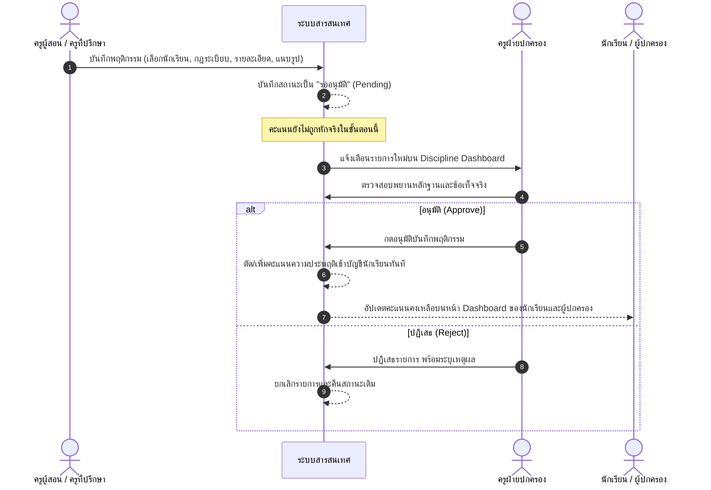
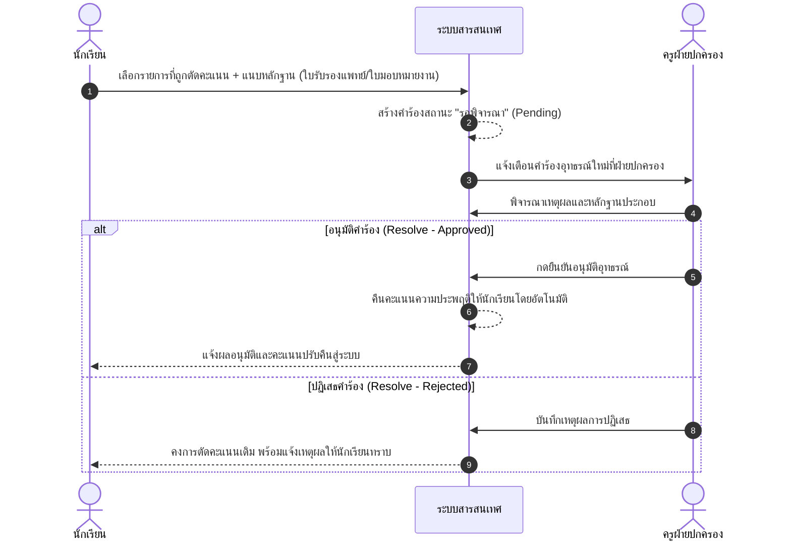
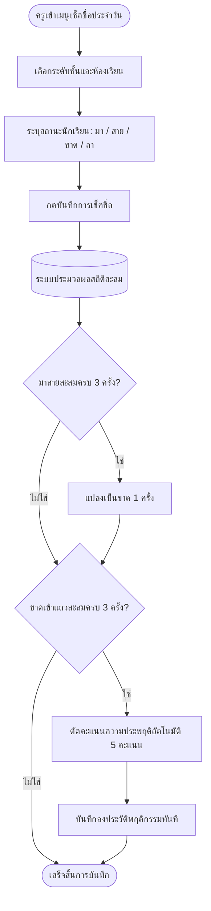
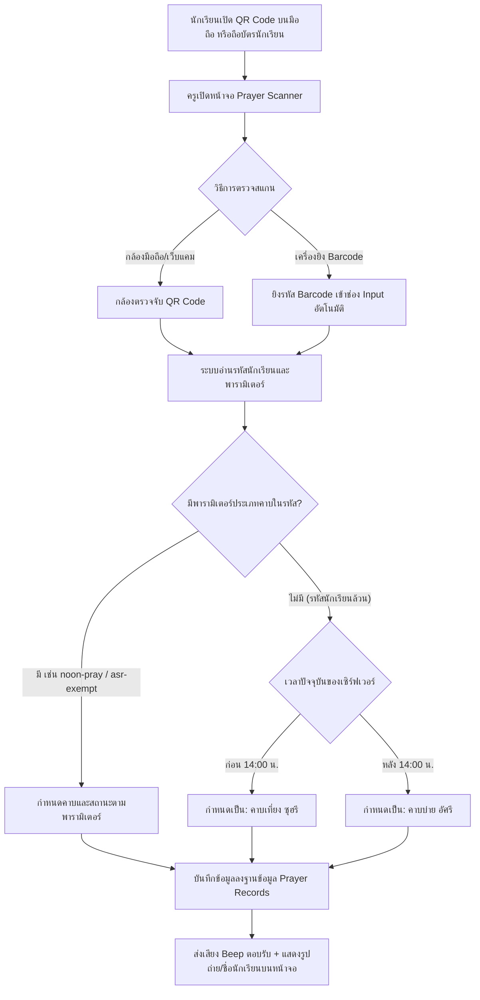

# คู่มือการใช้งานระบบและการทำงานของระบบสารสนเทศการบริหารงานวินัยและติดตามพฤติกรรมนักเรียน
## (Student Discipline and Behavior Tracking System - User & Operations Manual)
**กรณีศึกษา : โรงเรียนศิริราษฎร์สามัคคี อำเภอยะรัง จังหวัดปัตตานี**

---

## 📌 บทนำและภาพรวมระบบ (System Overview)

ระบบสารสนเทศการบริหารงานวินัยและติดตามพฤติกรรมนักเรียน ถูกพัฒนาขึ้นเพื่อยกระดับการบริหารจัดการงานฝ่ายปกครอง งานกิจการนักเรียน และงานครูที่ปรึกษา จากรูปแบบดั้งเดิมที่ใช้เอกสารกระดาษและสมุดจดบันทึก สู่ระบบดิจิทัลแบบรวมศูนย์ (Centralized Web-based Platform) ช่วยให้การกำกับดูแลวินัย การประเมินพฤติกรรม การเช็คชื่อเข้าแถว/เข้าเรียน และการบันทึกการปฏิบัติศาสนกิจ (การละหมาด) มีความโปร่งใส รวดเร็ว ตรวจสอบได้แบบเรียลไทม์ และเปิดโอกาสให้ผู้ปกครองและนักเรียนมีส่วนร่วมในการติดตามและปรับปรุงพฤติกรรม

```
+-------------------------------------------------------------------------------------------------+
|                                 โครงสร้างหลัก 5 กลุ่มผู้ใช้งานระบบ                                 |
+-------------------+--------------------+-------------------+------------------+-----------------+
| ผู้ดูแลระบบ (Admin) | ฝ่ายปกครอง         | ครูผู้สอน/ที่ปรึกษา| นักเรียน (Student)| ผู้ปกครอง       |
|                   | (Discipline)       | (Teacher)         |                  | (Parent)        |
+-------------------+--------------------+-------------------+------------------+-----------------+
| จัดการผู้ใช้/สิทธิ์ | ตั้งเกณฑ์กฎระเบียบ   | เช็คชื่อประจำวัน   | ดูคะแนนคงเหลือ    | ติดตามคะแนนลูก  |
| ข้อมูลนักเรียน/ครู | อนุมัติการตัดคะแนน | บันทึกพฤติกรรม     | ดูประวัติเข้าแถว  | ดูประวัติเข้าเรียน|
| พิมพ์บัตร QR Code | พิจารณาคำร้องอุทธรณ์ | สแกนเช็คชื่อละหมาด | ยื่นคำร้องขออุทธรณ์| แชทติดต่อครู    |
| นำเข้าข้อมูล Excel | ตรวจเรื่องแจ้งเบาะแส| แชทคุยกับผู้ปกครอง | เปิด QR ละหมาด   | สลับดูบุตรหลาน  |
| สลับ/ตั้งค่าภาคเรียน| สรุปรายงานสถิติ    | ดูสถิติห้องที่ปรึกษา | แจ้งเบาะแสออนไลน์  |                 |
+-------------------+--------------------+-------------------+------------------+-----------------+
```

---

## 🔄 แผนภาพกระบวนการทำงานหลักของระบบ (Core Workflows)

ระบบประกอบด้วยกระบวนการทำงานหลัก 4 สายงานสำคัญ ดังนี้:

### 1. วงจรการบันทึกพฤติกรรมและการอนุมัติคะแนน (Behavior Logging & Approval)
ป้องกันการใช้อำนาจตัดคะแนนโดยพลการ ด้วยระบบ **"ครูส่งเรื่อง -> ฝ่ายปกครองตรวจสอบและอนุมัติ"**



---

### 2. วงจรการยื่นคำร้องขออุทธรณ์คะแนน (Appeals & Score Restitution)
เปิดโอกาสให้นักเรียนรักษาสิทธิ์ เมื่อมีเหตุจำเป็นหรือทำกิจกรรมบำเพ็ญประโยชน์ชดเชย



---

### 3. ระบบเช็คชื่อเข้าแถวและคำนวณตัดคะแนนอัตโนมัติ (Daily Attendance & Auto-Penalty)
ระบบมีระบบตรวจนับสถิติการเข้าแถวและตัดคะแนนตามเกณฑ์วินัยของโรงเรียนอัตโนมัติ:



---

### 4. ระบบสแกนเช็คชื่อการละหมาดประจำวัน (Prayer Scanner & Auto-Period Detection)
รองรับทั้งการสแกนผ่าน **กล้องเว็บแคม (Webcam)** และ **เครื่องยิงบาร์โค้ด (USB Barcode Scanner)**



---

## 🔑 ข้อมูลบัญชีสำหรับทดสอบระบบ (Default Test Accounts)

ระบบมาพร้อมกับบัญชีผู้ใช้ทดสอบที่ครอบคลุมทุกบทบาท โดยทุกบัญชีถูกตั้งรหัสผ่านเริ่มต้นเหมือนกันทั้งหมด:

> [!IMPORTANT]
> **รหัสผ่านเริ่มต้นสำหรับทุกบัญชีทดสอบ:** **`password123`**  
> ลิงก์เข้าสู่ระบบ: `https://406665027.site.yru.ac.th/login` หรือ `http://localhost/login`

| บทบาท (Role) | บัญชีผู้ใช้ (Username) | ชื่อ-นามสกุลในระบบ | สิทธิ์และหน้าที่หลัก |
| :--- | :--- | :--- | :--- |
| **ผู้ดูแลระบบ (Admin)** | `admin` | Admin System | จัดการผู้ใช้, นักเรียน, ครู, บัตรนักเรียน, สิทธิ์ระบบ, ภาคเรียน |
| **ฝ่ายปกครอง (Discipline)** | `discipline1` | ครูสมชาย ฝ่ายปกครอง | กำหนดเกณฑ์คะแนน, อนุมัติตัด/เพิ่มคะแนน, ตรวจสอบอุทธรณ์, ดูแลเด็กกลุ่มเสี่ยง |
| **ครูผู้สอน/ที่ปรึกษา (Teacher)** | `teacher1` | ครูสมหญิง ที่ปรึกษา | เช็คชื่อเข้าเรียน, บันทึกพฤติกรรม, สแกนละหมาด, แชทกับผู้ปกครอง |
| **นักเรียน (Student)** | `student1` | ด.ช. ทดสอบ ระบบ | เช็คคะแนนคงเหลือ, ดูสถิติเข้าแถว, ยื่นอุทธรณ์, แสดง QR ละหมาด, แจ้งเบาะแส |
| **ผู้ปกครอง (Parent)** | `parent1` | ผู้ปกครอง ทดสอบ | ติดตามคะแนนลูกหลาน, ดูเวลาเรียน, แชทกับครูที่ปรึกษา, สลับดูบุตรหลาน |

---

## 📋 ตารางเมทริกซ์สิทธิ์การเข้าถึงโมดูล (Role Permissions Matrix)

| โมดูล / ฟังก์ชันการทำงาน | ผู้ดูแลระบบ (Admin) | ฝ่ายปกครอง (Discipline) | ครู (Teacher) | นักเรียน (Student) | ผู้ปกครอง (Parent) |
| :--- | :---: | :---: | :---: | :---: | :---: |
| แดชบอร์ดภาพรวม (Dashboard) | ✅ จัดการทั้งระบบ | ✅ ภาพรวมวินัย/เสี่ยง | ✅ ห้องที่ปรึกษา | ✅ คะแนนตนเอง | ✅ คะแนนบุตรหลาน |
| จัดการผู้ใช้งาน / ครู / นักเรียน | ✅ สร้าง/แก้ไข/ลบ | ❌ ดูได้บางส่วน | ❌ ดูห้องตนเอง | ❌ | ❌ |
| นำเข้าข้อมูลนักเรียน (Excel Import) | ✅ | ❌ | ❌ | ❌ | ❌ |
| พิมพ์บัตรนักเรียนและ QR Code | ✅ | ❌ | ❌ | ❌ | ❌ |
| กำหนดเกณฑ์กฎระเบียบคะแนน (Rules) | 👁️ ดูได้ | ✅ สร้าง/แก้ไข/ลบ | 👁️ ดูได้ | 👁️ ดูได้ | 👁️ ดูได้ |
| บันทึกความประพฤติ (Log Behavior) | 👁️ ดูได้ | ✅ บันทึก/ตัดทันที | ✅ บันทึกรออนุมัติ | ❌ | ❌ |
| อนุมัติบันทึกความประพฤติ (Approve) | ❌ | ✅ ตรวจสอบ/อนุมัติ | ❌ | ❌ | ❌ |
| พิจารณาคำร้องอุทธรณ์ (Appeals) | ❌ | ✅ พิจารณา/คืนคะแนน | ❌ | ✅ ยื่นคำร้อง/แนบหลักฐาน | 👁️ ดูสถานะ |
| แจ้งเบาะแสพฤติกรรม (Informant) | ❌ | ✅ ตรวจสอบ/ปิดเรื่อง | ❌ | ✅ ส่งเบาะแส (นิรนาม) | ❌ |
| เช็คชื่อเข้าแถว/เข้าเรียน (Attendance) | 👁️ ดูสถิติรวม | 👁️ ดูสถิติรวม | ✅ บันทึกประจำวัน | 👁️ ปฏิทินตนเอง | 👁️ สถิติบุตรหลาน |
| สแกนเช็คชื่อละหมาด (Prayer Scanner) | 👁️ ดูรายงาน | 👁️ ดูรายงาน | ✅ สแกน/แก้ไข | 👁️ แสดง QR ตนเอง | 👁️ ดูสถิติบวกลบ |
| กล่องข้อความติดต่อสื่อสาร (Messages) | ✅ ส่งได้ทุกกลุ่ม | ✅ ส่งหาครู/ผู้ปกครอง | ✅ สื่อสารผู้ปกครอง | ✅ สื่อสารกับครู | ✅ สื่อสารกับครู |
| การส่งออกรายงาน (Export PDF/Excel) | ✅ | ✅ | ❌ | ❌ | ❌ |

---

## 📖 คู่มือขั้นตอนการใช้งานแต่ละบทบาท (Step-by-Step User Manual)

---

### ส่วนที่ 1: ขั้นตอนการเข้าสู่ระบบ (Login) และการสลับบทบาท


*ภาพที่ 1: หน้าจอแสดงผลการเข้าสู่ระบบ (Login)*

1. เปิดเว็บเบราว์เซอร์ไปที่ URL ของระบบ (เช่น `https://406665027.site.yru.ac.th/login` หรือ `http://localhost/login`)
2. กรอก **ชื่อผู้ใช้ (Username)** และ **รหัสผ่าน (Password)**
3. คลิกปุ่ม **"เข้าสู่ระบบ"**
4. ระบบจะทำการตรวจสอบสิทธิ์และนำทางไปยังแดชบอร์ดตามบทบาทโดยอัตโนมัติ:
   - ผู้ดูแลระบบ -> `/admin/dashboard`
   - ฝ่ายปกครอง -> `/discipline/dashboard`
   - ครูผู้สอน/ที่ปรึกษา -> `/teacher/dashboard`
   - นักเรียน -> `/student/dashboard`
   - ผู้ปกครอง -> `/parent/dashboard`
5. **กรณีผู้ใช้มีหลายบทบาท (Multi-role):** เช่น ครูที่เป็นเจ้าหน้าที่ฝ่ายปกครองด้วย ระบบจะแสดงหน้าต่างให้เลือกบทบาทที่ต้องการเข้าใช้งาน หรือสามารถกดสลับบทบาทได้ตลอดเวลาที่เมนูด้านบนขวา

---

### ส่วนที่ 2: คู่มือสำหรับผู้ดูแลระบบ (Admin)

ผู้ดูแลระบบมีหน้าที่รับผิดชอบข้อมูลโครงสร้างพื้นฐาน บัญชีผู้ใช้งาน ข้อมูลนักเรียน ครู และสิทธิ์ความปลอดภัย

#### 2.1 แดชบอร์ดผู้ดูแลระบบ (Admin Dashboard)

*ภาพที่ 2: หน้าแดชบอร์ดของผู้ดูแลระบบ*
* **การแสดงผล:** การ์ดสรุปยอดรวมจำนวนนักเรียน, จำนวนครู, จำนวนผู้ปกครอง และสถิติการใช้งานระบบ
* **แถบควบคุมด้านบน:** สามารถสลับดูข้อมูลตาม **ปีการศึกษา/ภาคเรียน** ที่ต้องการตรวจสอบ
* **เมนูด้านข้าง (Sidebar):** เชื่อมต่อไปยังฟังก์ชันการจัดการทุกส่วนของระบบ

#### 2.2 การจัดการข้อมูลผู้ใช้งานระบบ (User Management)

*ภาพที่ 3: หน้าจอแสดงรายการข้อมูลผู้ใช้งาน*

*ภาพที่ 4: หน้าจอแบบฟอร์มเพิ่ม/แก้ไขข้อมูลผู้ใช้งาน*
* **การเพิ่มผู้ใช้:** คลิกปุ่ม **[+ เพิ่มผู้ใช้งาน]** กรอกชื่อ-นามสกุล, เลขประจำตัวประชาชน, เบอร์โทรศัพท์, อีเมล, บทบาท (Role), กำหนด Username และรหัสผ่าน
* **การค้นหาและกรอง:** ค้นหาตามชื่อ นามสกุล หรือกรองตามกลุ่มบทบาท
* **การแก้ไข/รีเซ็ตรหัสผ่าน:** คลิกไอคอนดินสอ เพื่อแก้ไขข้อมูลส่วนตัวหรือเปลี่ยนรหัสผ่าน
* **การระงับหรือลบบัญชี:** คลิกไอคอนถังขยะเพื่อปิดการใช้งานบัญชี

#### 2.3 การจัดการข้อมูลนักเรียน (Student Management)

*ภาพที่ 5: หน้าจอแสดงรายการข้อมูลนักเรียน*

*ภาพที่ 6: หน้าจอแบบฟอร์มเพิ่มข้อมูลนักเรียน*
* **การเพิ่มนักเรียน:** ป้อนรหัสประจำตัวนักเรียน, เลขบัตรประชาชน, คำนำหน้า, ชื่อ-นามสกุล, ระดับชั้น (ม.1 - ม.6) และห้องเรียน
* **การจัดห้องเรียน:** สามารถย้ายห้องหรือปรับสถานะนักเรียนได้สะดวกรวดเร็ว

#### 2.4 การพิมพ์บัตรประจำตัวนักเรียนและ QR Code (Student ID Card)

*ภาพที่ 7: หน้าจอแสดงบัตรประจำตัวนักเรียนและ QR Code*
* เข้าไปที่หน้ารายชื่อนักเรียน แล้วคลิกปุ่ม **[พิมพ์บัตรประจำตัว]**
* ระบบจะจัดรูปแบบบัตรประจำตัวขนาดมาตรฐาน พร้อมรูปถ่าย ข้อมูลนักเรียน และ **QR Code ประจำตัว** ที่เข้ารหัสรหัสนักเรียนไว้ สำหรับใช้สแกนเข้าแถวและเช็คชื่อละหมาด
* สามารถกดปุ่มสั่งพิมพ์ออกเครื่องพิมพ์หรือบันทึกเป็น PDF ได้ทันที

#### 2.5 การนำเข้าข้อมูลนักเรียนผ่านไฟล์ Excel/CSV (Student Import)

*ภาพที่ 8: หน้าจอนำเข้าข้อมูลนักเรียนผ่าน Excel*
1. คลิกปุ่ม **[ดาวน์โหลดไฟล์แม่แบบ (Template)]** เพื่อรับไฟล์ Excel โครงสร้างที่ถูกต้อง
2. กรอกข้อมูลนักเรียนลงในตาราง Excel
3. ลากหรือแนบไฟล์ `.xlsx` หรือ `.csv` เข้าสู่ระบบ แล้วคลิก **[อัปโหลดและนำเข้าข้อมูล]**
4. ระบบจะทำการตรวจสอบความซ้ำซ้อน สร้างบัญชีผู้ใช้งาน และผูกข้อมูลนักเรียนเข้าห้องเรียนให้อัตโนมัติ

#### 2.6 การจัดการข้อมูลผู้ปกครองและผูกบุตรหลาน (Parent Management)

*ภาพที่ 9: หน้าจอจัดการข้อมูลผู้ปกครองและเชื่อมโยงบุตรหลาน*
* คลิกเมนู **[จัดการผู้ปกครอง]** ภายใต้นักเรียนคนนั้น ๆ
* ระบุชื่อ-นามสกุล, ความสัมพันธ์ (บิดา, มารดา, ผู้ปกครอง), เบอร์โทรศัพท์ และเลขบัตรประชาชน
* ผู้ปกครอง 1 คน สามารถผูกกับบุตรหลานได้หลายคน ทำให้สามารถสลับดูข้อมูลลูกทุกคนได้ในบัญชีเดียว

#### 2.7 การจัดการข้อมูลครูและห้องเรียนที่ปรึกษา (Teacher Management)

*ภาพที่ 10: หน้าจอแสดงรายการข้อมูลครูและห้องเรียนประจำชั้น*
* บันทึกข้อมูลครูผู้สอน พร้อมกำหนด **ห้องเรียนที่ปรึกษา (Advisory Classroom)** เช่น ครูสมหญิง ดูแลห้อง ม.3/1
* ครูจะได้รับสิทธิ์ในการเช็คชื่อและดูสถิตินักเรียนเฉพาะห้องที่ตนเองเป็นที่ปรึกษาโดยอัตโนมัติ

#### 2.8 การตรวจสอบตารางสิทธิ์ของบทบาท (Role & Permissions Matrix)

*ภาพที่ 11: หน้าจอตารางแสดงสิทธิ์การเข้าถึงโมดูล*
* แสดงตารางสิทธิ์การเข้าถึงเมนูต่าง ๆ ทั้งหมดของแต่ละบทบาท
* สัญลักษณ์: 👁️ (ดูข้อมูลได้), ✏️ (บันทึก/แก้ไขข้อมูลได้), ❌ (ไม่อนุญาตให้เข้าถึง) ช่วยให้ผู้ดูแลระบบมั่นใจในความปลอดภัยของระบบ

---

### ส่วนที่ 3: คู่มือสำหรับฝ่ายปกครอง (Discipline Officer)

ฝ่ายปกครองมีหน้าที่กำกับดูแลกฎระเบียบ พิจารณาอนุมัติคะแนน ตรวจสอบเรื่องอุทธรณ์ และติดตามนักเรียนกลุ่มเสี่ยง

#### 3.1 แดชบอร์ดฝ่ายปกครอง (Discipline Dashboard)

*ภาพที่ 12: หน้าแดชบอร์ดฝ่ายปกครอง*
* สรุปการกระทำความผิดล่าสุด และกราฟแยกตามหมวดหมู่ความผิด
* กล่องแจ้งเตือนด่วน: รายการบันทึกพฤติกรรมรออนุมัติ, คำร้องอุทธรณ์รอพิจารณา และเรื่องแจ้งเบาะแสใหม่

#### 3.2 การเฝ้าระวังนักเรียนกลุ่มเสี่ยง (Risk Students Monitor)

*ภาพที่ 13: หน้าจอติดตามนักเรียนกลุ่มเสี่ยง (Risk Students)*
* ระบบคัดกรองนักเรียนที่มีคะแนนความประพฤติสะสมต่ำกว่าเกณฑ์อัตโนมัติ:
  - **แถบสีเหลือง (เฝ้าระวัง):** คะแนนเหลือต่ำกว่า 60 คะแนน
  - **แถบสีส้ม (เตือนภัย):** คะแนนเหลือต่ำกว่า 50 คะแนน (เกณฑ์ไม่ผ่านการประเมิน)
  - **แถบสีแดง (วิกฤต):** คะแนนเหลือต่ำกว่า 30 คะแนน (เตรียมเชิญผู้ปกครอง/พิจารณาพักการเรียน)
* ฝ่ายปกครองสามารถกดดูประวัติย้อนหลัง หรือคลิกปุ่มส่งข้อความหาผู้ปกครองได้ทันที

#### 3.3 การตั้งค่าเกณฑ์กฎระเบียบคะแนนพฤติกรรม (Behavior Rules Setup)

*ภาพที่ 14: หน้าจอแสดงรายการเกณฑ์กฎระเบียบวินัย*

*ภาพที่ 15: หน้าจอแบบฟอร์มเพิ่มกฎระเบียบและคะแนน*
* คลิกปุ่ม **[+ เพิ่มกฎระเบียบ]**
* กำหนดชื่อข้อระเบียบ เช่น "แต่งกายผิดระเบียบ", "มาสายเกินกำหนด", "ช่วยเหลือกิจกรรมโรงเรียน"
* เลือกประเภท: **หักคะแนนความประพฤติ (-)** หรือ **เพิ่มคะแนนความดี (+)**
* กำหนดจำนวนคะแนน เช่น `-5`, `-10`, `+10` แล้วกดบันทึก

#### 3.4 การตรวจสอบและอนุมัติการบันทึกพฤติกรรม (Approve Records)

*ภาพที่ 16: หน้าจอตรวจสอบและอนุมัติบันทึกพฤติกรรม*
* เมื่อครูประจำชั้นส่งเรื่องบันทึกพฤติกรรมเข้ามา รายการจะแสดงในสถานะ **"รออนุมัติ"**
* ฝ่ายปกครองกดดูรายละเอียด ตรวจสอบภาพหลักฐานและสถานที่เกิดเหตุ
* คลิก **[อนุมัติ (Approve)]** เพื่อยืนยันการตัดหรือเพิ่มคะแนนนักเรียนอย่างเป็นทางการ
* หรือคลิก **[ปฏิเสธ (Reject)]** พร้อมระบุข้อความเหตุผลส่งกลับไปยังครูผู้บันทึก

#### 3.5 การพิจารณาคำร้องขออุทธรณ์คะแนน (Review Appeals)

*ภาพที่ 17: หน้าจอพิจารณาคำร้องอุทธรณ์คะแนน*
* เมื่อนักเรียนยื่นคำร้องอุทธรณ์ ฝ่ายปกครองเปิดดูรายละเอียดข้อชี้แจงและเอกสารแนบ (เช่น ใบรับรองแพทย์ หรือใบรับรองการบำเพ็ญประโยชน์)
* คลิกปุ่ม **[อนุมัติการอุทธรณ์]** : ระบบจะทำการ **คืนคะแนนความประพฤติให้นักเรียนโดยอัตโนมัติ**
* หรือคลิกปุ่ม **[ปฏิเสธคำร้อง]** : เพื่อยืนยันการตัดคะแนนตามเดิม

#### 3.6 การจัดการเรื่องแจ้งเบาะแสพฤติกรรม (Informant Reports)

*ภาพที่ 18: หน้าจอรายการแจ้งเบาะแสพฤติกรรม*
* ตรวจดูเรื่องที่นักเรียนส่งแจ้งเบาะแส (เช่น พฤติกรรมมั่วสุม, การสูบบุหรี่, การทะเลาะวิวาท)
* ระบบแสดงระดับความปลอดภัย: รายงานที่มีชื่อ หรือรายงานแบบปกปิดชื่อ (Anonymous)
* ฝ่ายปกครองคลิก **[รับเรื่องสืบสวน]** เมื่อเริ่มดำเนินการ และคลิก **[ปิดเรื่อง/จัดเก็บ]** เมื่อดำเนินการเสร็จสิ้น

#### 3.7 การออกรายงานสรุปพฤติกรรมและการส่งออกข้อมูล (Export Reports)

*ภาพที่ 19: หน้าจอรายงานสรุปพฤติกรรมและการส่งออกข้อมูล*
* เลือกช่วงวันที่, ระดับชั้น, หรือเลือกดูเฉพาะห้องเรียน
* คลิกปุ่ม **[พิมพ์รายงาน PDF]** สำหรับนำไปจัดทำเอกสารเสนอผู้อำนวยการโรงเรียน
* คลิกปุ่ม **[ส่งออก Excel]** สำหรับนำข้อมูลไปประมวลผลทางสถิติหรือวิจัย

---

### ส่วนที่ 4: คู่มือสำหรับครูผู้สอนและครูที่ปรึกษา (Teacher)

ครูมีบทบาทใกล้ชิดนักเรียน ทำหน้าที่เช็คชื่อประจำวัน บันทึกพฤติกรรมเบื้องต้น และสแกนเช็คชื่อละหมาด

#### 4.1 แดชบอร์ดครูและข้อมูลห้องเรียนที่ปรึกษา (My Classroom)

*ภาพที่ 20: หน้าแดชบอร์ดครูและห้องเรียนที่รับผิดชอบ*
* แสดงภาพรวมคะแนนเฉลี่ยของนักเรียนในห้องที่ปรึกษา
* แสดงรายชื่อนักเรียนที่มีคะแนนพฤติกรรมต่ำ เพื่อให้ครูสามารถตักเตือนและแนะแนวได้อย่างทันท่วงที

#### 4.2 การเช็คชื่อเข้าแถวและเวลาเรียนประจำวัน (Daily Attendance)

*ภาพที่ 21: หน้าจอเช็คชื่อการเข้าเรียนประจำวัน*
1. เข้าเมนู `บันทึกการเข้าเรียน/เช็คชื่อ` (`/teacher/attendance`)
2. เลือกระดับชั้นและห้องเรียน
3. ระบบจะแสดงรายชื่อนักเรียนทุกคน ให้เลือกสถานะ: **[มา] [สาย] [ขาด] [ลา]**
4. มีปุ่มลัด **[มาทั้งหมด]** ช่วยให้เช็คชื่อได้อย่างรวดเร็วในวันปกติ
5. คลิกปุ่ม **[บันทึกการเช็คชื่อ]**

#### 4.3 การบันทึกคะแนนพฤติกรรมนักเรียน (Log Behavior Record)

*ภาพที่ 22: หน้าจอแบบฟอร์มบันทึกพฤติกรรมนักเรียน*
1. ไปที่เมนู `บันทึกพฤติกรรม` (`/teacher/behavior-records/create`)
2. ค้นหารหัสนักเรียน หรือพิมพ์ชื่อ-นามสกุล
3. เลือกข้อกฎระเบียบที่นักเรียนกระทำ (ระบบจะแสดงคะแนนหักหรือบวกตามเกณฑ์)
4. กรอกสถานที่เกิดเหตุ รายละเอียดเหตุการณ์ และแนบไฟล์รูปถ่ายหลักฐาน
5. คลิก **[ส่งบันทึก]** (รายการจะถูกส่งต่อไปยังฝ่ายปกครองเพื่อรอการอนุมัติ)

#### 4.4 การสแกนเช็คชื่อละหมาด (Prayer Scanner)

*ภาพที่ 23: หน้าจอเครื่องสแกน QR Code สำหรับเช็คชื่อละหมาด*
* ครูเปิดหน้าจอนี้ผ่านสมาร์ตโฟน แท็บเล็ต หรือโน้ตบุ๊กที่เชื่อมต่อกล้องหรือเครื่องยิงบาร์โค้ด
* สแกน **QR Code บนบัตรนักเรียน** หรือ **บนจอมือถือของนักเรียน**
* ระบบจะส่งเสียงสัญญาณ Beep ตอบรับ พร้อมแสดงชื่อ ภาพถ่าย และห้องเรียนของนักเรียนทันที
* รองรับการบันทึกสถานะ: ละหมาดปกติ, ขาดละหมาด, หรือติดภารกิจทางศาสนา/มีรอบเดือน (Exempt)

#### 4.5 กล่องข้อความติดต่อสื่อสารกับผู้ปกครอง (Teacher Messages)

*ภาพที่ 24: หน้าจอกล่องข้อความติดต่อสื่อสารของครู*
* พูดคุยโต้ตอบกับผู้ปกครองของนักเรียนในห้องที่ปรึกษา
* รับเอกสารใบลา ใบรับรองแพทย์ หรือภาพถ่ายจากผู้ปกครอง
* แจ้งพฤติกรรมของนักเรียนให้ผู้ปกครองรับทราบแบบส่วนตัวและปลอดภัย

---

### ส่วนที่ 5: คู่มือสำหรับนักเรียน (Student)

นักเรียนสามารถตรวจสอบสถานะของตนเองอย่างโปร่งใส และใช้สิทธิ์ยื่นอุทธรณ์เมื่อมีเหตุจำเป็น

#### 5.1 แดชบอร์ดนักเรียนและคะแนนพฤติกรรมคงเหลือ (Student Dashboard)

*ภาพที่ 25: หน้าแดชบอร์ดแสดงคะแนนความประพฤตินักเรียน*
* แสดง **คะแนนพฤติกรรมคงเหลือ** (เริ่มต้น 100 คะแนนเต็ม) พร้อมมาตรวัดสีเขียว/เหลือง/แดง
* แสดงประวัติการถูกตัด-เพิ่มคะแนนล่าสุด พร้อมเหตุผลและวันที่ทำรายการ
* แสดงสรุปสถิติการเข้าเรียนและการเช็คชื่อละหมาดของตนเอง

#### 5.2 ปฏิทินและสถิติการเข้าแถวประจำเดือน (Student Attendance Calendar)

*ภาพที่ 26: หน้าจอปฏิทินและสถิติการเข้าแถวของนักเรียน*
* **ปฏิทินประจำเดือน:** แสดงไอคอนสถานะการเข้าแถวในแต่ละวันอย่างชัดเจน (มา, สาย, ขาด, ลา)
* **เกณฑ์การตัดคะแนนอัตโนมัติ:** แสดงข้อความเตือนให้ทราบว่า ขาดเข้าแถวสะสมครบทุก 3 ครั้ง จะถูกตัด 5 คะแนน (โดยมาสาย 3 ครั้ง เทียบเท่าขาด 1 ครั้ง)
* **ปุ่มสรุปสถิติรายเดือน:** คลิกปุ่ม **[สรุปสถิติแต่ละเดือน (ร้อยละ %)]** เพื่อดูอัตราร้อยละการมาเรียนตลอดทั้งเทอม

#### 5.3 การยื่นคำร้องขออุทธรณ์คะแนน (Submit Appeal)

*ภาพที่ 27: หน้าจอแบบฟอร์มยื่นคำร้องขออุทธรณ์คะแนน*
1. เข้าเมนู `ยื่นคำร้องอุทธรณ์` (`/student/appeals/create`)
2. เลือกรายการบันทึกพฤติกรรมที่ต้องการยื่นคำร้อง
3. พิมพ์ข้อความชี้แจงเหตุผลและข้อเท็จจริง
4. แนบไฟล์หลักฐานประกอบ เช่น ภาพถ่ายใบรับรองแพทย์ หนังสือรับรองจากผู้ปกครอง หรือหลักฐานการบำเพ็ญประโยชน์
5. คลิกปุ่ม **[ส่งคำร้องอุทธรณ์]** และติดตามผลการพิจารณาจากฝ่ายปกครองผ่านระบบ

#### 5.4 การเปิดบัตร QR Code ประจำตัวเพื่อเช็คชื่อละหมาด (Prayer QR Check-in)

*ภาพที่ 28: หน้าจอแสดง QR Code ประจำตัวสำหรับเช็คชื่อละหมาด*
* นักเรียนเปิดหน้านี้ผ่านโทรศัพท์มือถือขณะต่อแถวละหมาด
* ยื่น QR Code บนหน้าจอให้ครูหรือเจ้าหน้าที่สแกน
* หน้าจอจะแสดงสถานะการเช็คชื่อละหมาดในวันนี้ (รอบเที่ยง / รอบบ่าย) ให้เห็นทันที

#### 5.5 การส่งเรื่องแจ้งเบาะแสพฤติกรรมแบบไม่ระบุตัวตน (Informant Report)

*ภาพที่ 29: หน้าจอแจ้งเบาะแสพฤติกรรมที่ไม่เหมาะสม*
* ทำหน้าที่เป็น "ตู้แดงออนไลน์" ให้นักเรียนช่วยสอดส่องความปลอดภัยในโรงเรียน
* ระบุพฤติกรรม สถานที่เกิดเหตุ วันที่ และแนบรูปภาพหลักฐาน
* เลือกตัวเลือก **"แจ้งแบบปกปิดชื่อ (Anonymous)"** เพื่อความปลอดภัยสูงสุดของผู้แจ้ง

---

### ส่วนที่ 6: คู่มือสำหรับผู้ปกครอง (Parent / Guardian)

ช่วยให้ผู้ปกครองติดตามดูแลบุตรหลานได้อย่างใกล้ชิด ร่วมมือกับโรงเรียนในการปรับปรุงพฤติกรรม

#### 6.1 แดชบอร์ดผู้ปกครองและการสลับดูบุตรหลาน (Parent Dashboard)

*ภาพที่ 30: หน้าแดชบอร์ดผู้ปกครอง*
* แสดงคะแนนพฤติกรรมคงเหลือของบุตรหลานแบบเรียลไทม์
* **ปุ่มสลับดูบุตรหลาน:** ในกรณีที่ผู้ปกครองมีบุตรหลานเรียนอยู่หลายคน สามารถคลิกปุ่มสลับเพื่อเปลี่ยนไปดูข้อมูลของนักเรียนแต่ละคนได้อย่างสะดวกโดยไม่ต้องล็อกเอาต์

#### 6.2 การตรวจสอบคะแนนพฤติกรรมและเวลาเรียน (Behavior & Attendance History)

*ภาพที่ 31: หน้าจอประวัติพฤติกรรมและการเช็คชื่อบุตรหลาน*
* ดูประวัติการถูกตัดคะแนนอย่างละเอียด: วันที่, กฎระเบียบที่กระทำผิด, ครูผู้บันทึก, และคะแนนคงเหลือ
* ดูประวัติการเข้าแถวและการขาดเรียน เพื่อให้ตักเตือนบุตรหลานได้ทันก่อนที่จะสายเกินไป

#### 6.3 การส่งข้อความติดต่อครูที่ปรึกษา (Parent Messaging)

*ภาพที่ 32: หน้าจอส่งข้อความติดต่อครูที่ปรึกษา*
* ส่งข้อความแชทตรงถึงครูที่ปรึกษาของบุตรหลาน
* แจ้งการลากิจ / ลาป่วย พร้อมแนบรูปถ่ายใบรับรองแพทย์ได้อย่างสะดวก
* สอบถามข้อสงสัยเกี่ยวกับพฤติกรรมและการเรียนได้อย่างเป็นส่วนตัว

---

## ⚙️ กฎเกณฑ์และตรรกะการประมวลผลอัตโนมัติ (Automated Business Logic)

### 1. เกณฑ์การตัดคะแนนการเข้าแถวอัตโนมัติ (Automated Attendance Penalty)
* **เกณฑ์นับสถิติ:**
  * มาสาย 3 ครั้ง = เทียบเท่าขาด 1 ครั้ง
  * ขาดเข้าแถวสะสมครบทุก 3 ครั้ง = **ตัดคะแนนความประพฤติอัตโนมัติ 5 คะแนน**
* **การทำงานของระบบ:** ระบบจะคำนวณสถิติสะสมให้อัตโนมัติเมื่อครูกดบันทึกการเช็คชื่อประจำวัน และหากครบเกณฑ์ จะสร้างรายการตัดคะแนนเข้าประวัติพฤติกรรมของนักเรียนทันที

### 2. เกณฑ์การคัดกรองนักเรียนกลุ่มเสี่ยง (Risk Students Criteria)
* **คะแนนเต็มเริ่มต้น:** 100 คะแนน
* **ระดับการแจ้งเตือน:**
  * 🟢 **ปกติ (Normal):** 60 - 100 คะแนน
  * 🟡 **เฝ้าระวัง (Warning):** 50 - 59 คะแนน
  * 🟠 **กลุ่มเสี่ยง (Risk - เกณฑ์ไม่ผ่าน):** 30 - 49 คะแนน (เข้าข่ายไม่ผ่านเกณฑ์การประเมินพฤติกรรม)
  * 🔴 **วิกฤต (Critical):** ต่ำกว่า 30 คะแนน (ส่งต่อผู้อำนวยการ เชิญผู้ปกครองทำทัณฑ์บน)

### 3. ระบบตรวจจับคาบละหมาดอัตโนมัติ (Prayer Auto-Period Detection)
* **การตรวจจับตามช่วงเวลา (Server Time):**
  * สแกนก่อนเวลา `14:00 น.` -> กำหนดเป็น **คาบเที่ยง (ซุฮรี - Dhuhr)**
  * สแกนตั้งแต่เวลา `14:00 น.` เป็นต้นไป -> กำหนดเป็น **คาบบ่าย (อัศรี - Asr)**
* **การตรวจจับตามรหัสบาร์โค้ดพิเศษ (Parameter Override):**
  * หาก QR Code หรือ Barcode มีพารามิเตอร์ต่อท้าย เช่น `10001-noon-pray` หรือ `10001-asr-exempt` ระบบจะยึดตามค่าพารามิเตอร์ของรหัสนั้นโดยไม่อิงตามเวลาของเครื่องสแกน
* **การยกเว้นละหมาด (Exemption):** บันทึกสถานะ "ละหมาดไม่ได้" สำหรับนักเรียนหญิงที่มีรอบเดือน เพื่อเก็บสถิติความถูกต้องโดยไม่มีการหักคะแนนพฤติกรรมใด ๆ

### 4. ระบบเลื่อนชั้นปีการศึกษาอัตโนมัติ (Automatic Semester Promotion)
* เมื่อผู้ดูแลระบบทำการปิดภาคเรียนหรือเปลี่ยนปีการศึกษา ระบบจะประเมินคะแนนพฤติกรรมสะสมของนักเรียน:
  * นักเรียนที่มีคะแนนสะสม **$\ge 50$ คะแนน** จะได้รับการเลื่อนชั้นอัตโนมัติ
  * นักเรียนที่มีคะแนน **$< 50$ คะแนน** จะถูกคงสถานะติดเงื่อนไขการแก้คะแนนความประพฤติ

---

## 🗺️ ตารางสรุปโครงสร้างเส้นทางในระบบ (Routes & URLs Directory)

| เส้นทาง (Route / URL) | ชื่อ Route ในระบบ | บทบาทที่ได้รับสิทธิ์ | หน้าที่การทำงาน |
| :--- | :--- | :---: | :--- |
| `/login` | `login` | ทุกคน | หน้าเข้าสู่ระบบ |
| `/logout` | `logout` | ผู้ใช้ที่เข้าสู่ระบบ | ออกจากระบบและทำลาย Session |
| `/home` | `home` | ผู้ใช้ที่เข้าสู่ระบบ | นำทางไปยัง Dashboard ตามบทบาทของผู้ใช้ |
| `/select-role` | `select-role` | ผู้ใช้ที่มีหลายบทบาท | เลือกบทบาทที่ต้องการเข้าใช้งาน |
| **ส่วนของผู้ดูแลระบบ (Admin)** | | | |
| `/admin/dashboard` | `admin.dashboard` | ผู้ดูแลระบบ | แดชบอร์ดภาพรวมระบบ |
| `/admin/users` | `admin.users.index` | ผู้ดูแลระบบ | รายการผู้ใช้งานระบบทั้งหมด |
| `/admin/users/create` | `admin.users.create` | ผู้ดูแลระบบ | ฟอร์มเพิ่มบัญชีผู้ใช้งานใหม่ |
| `/admin/students` | `admin.students.index` | ผู้ดูแลระบบ | รายการข้อมูลนักเรียน |
| `/admin/students/create` | `admin.students.create` | ผู้ดูแลระบบ | ฟอร์มเพิ่มข้อมูลนักเรียน |
| `/admin/students/{id}/card` | `admin.students.card` | ผู้ดูแลระบบ | พิมพ์บัตรประจำตัวนักเรียนและ QR Code |
| `/admin/students/import` | `admin.students.import` | ผู้ดูแลระบบ | นำเข้าข้อมูลนักเรียนผ่านไฟล์ Excel |
| `/admin/students/{id}/parents` | `admin.students.parents.index` | ผู้ดูแลระบบ | จัดการข้อมูลผู้ปกครองของนักเรียน |
| `/admin/teachers` | `admin.teachers.index` | ผู้ดูแลระบบ | รายการข้อมูลครูและห้องเรียนที่ปรึกษา |
| `/admin/permissions` | `admin.permissions.index` | ผู้ดูแลระบบ | ตารางแสดงสิทธิ์ของแต่ละบทบาท |
| **ส่วนของฝ่ายปกครอง (Discipline)** | | | |
| `/discipline/dashboard` | `discipline.dashboard` | ฝ่ายปกครอง | แดชบอร์ดงานวินัยและแจ้งเตือนค้าง |
| `/discipline/risk-students` | `discipline.risk-students` | ฝ่ายปกครอง | รายชื่อนักเรียนกลุ่มเสี่ยงคะแนนต่ำ |
| `/discipline/behavior-rules` | `discipline.behavior-rules.index` | ฝ่ายปกครอง | รายการเกณฑ์กฎระเบียบคะแนนวินัย |
| `/discipline/behavior-records` | `discipline.behavior-records.index` | ฝ่ายปกครอง | รายการบันทึกพฤติกรรมรออนุมัติ |
| `/discipline/appeals` | `discipline.appeals.index` | ฝ่ายปกครอง | ตรวจสอบและพิจารณาคำร้องอุทธรณ์ |
| `/discipline/informant-reports` | `discipline.informant-reports.index` | ฝ่ายปกครอง | ตรวจสอบและจัดการเรื่องแจ้งเบาะแส |
| `/discipline/behavior-report` | `discipline.behavior-report` | ฝ่ายปกครอง | รายงานสรุปพฤติกรรมและส่งออกข้อมูล |
| **ส่วนของครูผู้สอนและที่ปรึกษา (Teacher)** | | | |
| `/teacher/dashboard` | `teacher.dashboard` | ครู | แดชบอร์ดครูและสถิติห้องเรียน |
| `/teacher/classroom` | `teacher.classroom.index` | ครู | รายชื่อนักเรียนในห้องเรียนที่ปรึกษา |
| `/teacher/attendance` | `teacher.attendance.index` | ครู | เช็คชื่อเข้าแถวและเข้าชั้นเรียนประจำวัน |
| `/teacher/behavior-records/create`| `teacher.behavior-records.create`| ครู | ฟอร์มบันทึกพฤติกรรมส่งฝ่ายปกครอง |
| `/teacher/messages` | `teacher.messages.index` | ครู | กล่องข้อความพูดคุยกับผู้ปกครอง |
| **ส่วนของนักเรียน (Student)** | | | |
| `/student/dashboard` | `student.dashboard` | นักเรียน | แดชบอร์ดและคะแนนคงเหลือ |
| `/student/attendance` | `student.attendance.index` | นักเรียน | ปฏิทินและสถิติการเข้าแถวประจำเดือน |
| `/student/behavior-records` | `student.behavior-records.index` | นักเรียน | ประวัติการตัด-เพิ่มคะแนนความประพฤติ |
| `/student/appeals/create` | `student.appeals.create` | นักเรียน | ฟอร์มยื่นคำร้องขออุทธรณ์คะแนน |
| `/student/prayer-checkin` | `student.prayer-checkin` | นักเรียน | หน้าจอแสดง QR Code ประจำตัวเช็คละหมาด |
| `/student/informant-reports/create`| `student.informant-reports.create`| นักเรียน | แจ้งเบาะแสพฤติกรรมไม่เหมาะสม |
| **ส่วนของผู้ปกครอง (Parent)** | | | |
| `/parent/dashboard` | `parent.dashboard` | ผู้ปกครอง | แดชบอร์ดผู้ปกครองและสลับบุตรหลาน |
| `/parent/behavior-records` | `parent.behavior-records.index`| ผู้ปกครอง | ประวัติคะแนนพฤติกรรมของบุตรหลาน |
| `/parent/attendance` | `parent.attendance.index` | ผู้ปกครอง | ประวัติการเข้าเรียนและการขาดแถว |
| `/parent/messages` | `parent.messages.index` | ผู้ปกครอง | กล่องข้อความสื่อสารกับครูที่ปรึกษา |
| **ส่วนงานระบบละหมาด (Prayer Module)** | | | |
| `/prayer/scan` | `prayer.scan` | เจ้าหน้าที่/ครู | เครื่องสแกน QR Code/Barcode ละหมาด |
| `/prayer/calendar` | `prayer.calendar` | เจ้าหน้าที่/ครู | ปฏิทินและสถิติการละหมาดรวม |
| `/prayer/corrections/toggle` | `prayer.corrections.toggle` | เจ้าหน้าที่/ครู | ปรับแก้สถานะการละหมาดกรณีพิเศษ |

---

## 🛠️ การแก้ไขปัญหาเบื้องต้นและคำถามที่พบบ่อย (Troubleshooting & FAQs)

### 1. กล้องสแกน QR Code ในหน้าเช็คชื่อละหมาดไม่เปิดทำงาน
* **สาเหตุ:** เว็บเบราว์เซอร์ยังไม่ได้รับอนุญาตให้เข้าถึงกล้อง (Camera Permission) หรือไม่ได้เชื่อมต่อผ่าน HTTPS
* **วิธีแก้ไข:** 
  1. สังเกตไอคอนรูปแม่กุญแจหรือกล้องที่แถบที่อยู่เว็บ (Address bar) ของเบราว์เซอร์
  2. กดเลือก **"อนุญาต (Allow)"** ให้เข้าถึงกล้อง
  3. หากใช้งานบนมือถือ ตรวจสอบว่าระบบปฏิบัติการ (iOS/Android) ได้เปิดสิทธิ์การใช้งานกล้องให้กับเบราว์เซอร์แล้ว
  4. กรณีไม่สามารถใช้กล้องได้ ให้ใช้เครื่องยิง USB Barcode Scanner หรือพิมพ์รหัสนักเรียนผ่านแป้นพิมพ์แทนได้ทันที

### 2. เครื่องยิง USB Barcode Scanner สแกนแล้วข้อมูลไม่ขึ้น
* **สาเหตุ:** ตัวชี้ตำแหน่ง (Cursor Focus) ไม่ได้อยู่ในช่องรับรหัสบาร์โค้ด
* **วิธีแก้ไข:** 
  - ระบบมีฟังก์ชัน Auto-focus ให้โดยอัตโนมัติ หากหลุดโฟกัส ให้คลิกเมาส์ 1 ครั้งลงบนช่องข้อความสำหรับสแกนรหัส
  - ตรวจสอบว่าแป้นพิมพ์ของเครื่องสแกนตั้งค่าภาษาเป็นภาษาอังกฤษ (EN) เพื่อป้องกันรหัสตัวเลขเพี้ยน

### 3. รูปภาพหลักฐานหรือรูปถ่ายนักเรียนไม่แสดงผล
* **สาเหตุ:** การเชื่อมต่อ Symbolic Link ของโฟลเดอร์จัดเก็บไฟล์ (`storage/app/public`) ยังไม่สมบูรณ์บนเซิร์ฟเวอร์
* **วิธีแก้ไข:**
  - ผู้ดูแลระบบสามารถเข้าลิงก์ `https://406665027.site.yru.ac.th/fix-storage` เพื่อให้ระบบทำการสร้าง Symlink ใหม่โดยอัตโนมัติ
  - ระบบมี Route Fallback รองรับการดึงไฟล์ภาพโดยตรงผ่าน `/storage/{path}` แม้ไม่มี Symlink

### 4. มีการอัปเดตกฎระเบียบหรือข้อมูลระบบแล้วแต่หน้าจอไม่เปลี่ยน
* **สาเหตุ:** แคชของระบบ (View & Route Cache) ยังจำค่าเดิมไว้
* **วิธีแก้ไข:**
  - ผู้ดูแลระบบล็อกอินเข้าระบบ แล้วเปิด URL: `/clear-cache` ระบบจะทำการรันคำสั่งล้างแคชทั้งหมดให้ทันที
