# คู่มือการใช้งานระบบ (User Manual)
## ระบบสารสนเทศการบริหารงานวินัยและติดตามพฤติกรรมนักเรียน
### Student Discipline and Behavior Tracking System
**กรณีศึกษา : โรงเรียนศิริราษฎร์สามัคคี จังหวัดปัตตานี**
*(Information System Discipline and Monitoring Student Behavior : A Case Study of Sirirat Samakkhi School Pattani Province)*

---

### ข้อมูลเอกสารและผู้จัดทำ
* **สถาบันการศึกษา:** มหาวิทยาลัยราชภัฏยะลา (Yala Rajabhat University)
* **คณะ:** คณะวิทยาศาสตร์เทคโนโลยีและการเกษตร
* **หลักสูตร/สาขาวิชา:** หลักสูตรวิทยาศาสตรบัณฑิต สาขาวิชาเทคโนโลยีสารสนเทศ (IT)
* **จัดทำโดย:** 
  1. นายตอริก ลือแม &nbsp;&nbsp;&nbsp;&nbsp;&nbsp;&nbsp;&nbsp;&nbsp;&nbsp;&nbsp;&nbsp;&nbsp;&nbsp;&nbsp;&nbsp; รหัสนักศึกษา 406665012
  2. นายบุสริน มูซอ &nbsp;&nbsp;&nbsp;&nbsp;&nbsp;&nbsp;&nbsp;&nbsp;&nbsp;&nbsp;&nbsp;&nbsp;&nbsp;&nbsp;&nbsp;&nbsp; รหัสนักศึกษา 406665027
* **ปีการศึกษา:** 2569 (ภาคเรียนที่ 1)
* **โลโก้ที่ใช้งาน:** ตรามหาวิทยาลัยราชภัฏยะลา (`logo_university.jpg`), ตราสาขาวิชาเทคโนโลยีสารสนเทศ (`logo_department.jpg`) และ ตราโรงเรียนศิริราษฎร์สามัคคี (`logo.png`)

---

# สารบัญ (Table of Contents)

| เรื่อง | หน้า |
| :--- | :---: |
| **บทนำและข้อมูลเบื้องต้นของระบบ** | **1** |
| &nbsp;&nbsp;&nbsp;&nbsp;สิทธิ์การเข้าใช้งานระบบและบัญชีทดสอบ (Test Accounts) | 1 |
| &nbsp;&nbsp;&nbsp;&nbsp;หน้าเข้าสู่ระบบ (Login) | 2 |
| **1. กลุ่มของผู้ดูแลระบบ (Admin)** | **3** |
| &nbsp;&nbsp;&nbsp;&nbsp;1.1) หน้าแดชบอร์ดผู้ดูแลระบบ (Admin Dashboard) | 3 |
| &nbsp;&nbsp;&nbsp;&nbsp;1.2) การจัดการข้อมูลผู้ใช้งานระบบ (User Management) | 4 |
| &nbsp;&nbsp;&nbsp;&nbsp;1.3) การจัดการข้อมูลนักเรียน (Student Management) | 6 |
| &nbsp;&nbsp;&nbsp;&nbsp;1.4) การพิมพ์บัตรประจำตัวนักเรียนและ QR Code (Student ID Card) | 8 |
| &nbsp;&nbsp;&nbsp;&nbsp;1.5) การนำเข้าข้อมูลนักเรียนจากไฟล์ Excel/CSV (Student Import) | 9 |
| &nbsp;&nbsp;&nbsp;&nbsp;1.6) การจัดการข้อมูลผู้ปกครอง (Parent / Guardian) | 10 |
| &nbsp;&nbsp;&nbsp;&nbsp;1.7) การจัดการข้อมูลครูและครูที่ปรึกษา (Teacher Management) | 12 |
| &nbsp;&nbsp;&nbsp;&nbsp;1.8) การแสดงสิทธิ์การเข้าถึงโมดูลของแต่ละบทบาท (Role & Permissions) | 14 |
| **2. กลุ่มของฝ่ายปกครอง (Discipline Officer)** | **15** |
| &nbsp;&nbsp;&nbsp;&nbsp;2.1) หน้าแดชบอร์ดฝ่ายปกครอง (Discipline Dashboard) | 16 |
| &nbsp;&nbsp;&nbsp;&nbsp;2.2) หน้ารายชื่อนักเรียนกลุ่มเสี่ยง (Risk Students Monitor) | 17 |
| &nbsp;&nbsp;&nbsp;&nbsp;2.3) การตั้งค่าเกณฑ์กฎระเบียบคะแนนพฤติกรรม (Behavior Rules) | 18 |
| &nbsp;&nbsp;&nbsp;&nbsp;2.4) การตรวจสอบและอนุมัติการบันทึกพฤติกรรม (Approve Records) | 20 |
| &nbsp;&nbsp;&nbsp;&nbsp;2.5) การพิจารณาคำร้องขออุทธรณ์คะแนน (Review Appeals) | 22 |
| &nbsp;&nbsp;&nbsp;&nbsp;2.6) การจัดการเรื่องแจ้งเบาะแสพฤติกรรม (Informant Reports) | 24 |
| &nbsp;&nbsp;&nbsp;&nbsp;2.7) หน้ารายงานสรุปพฤติกรรมและการส่งออกข้อมูล (Reports & Export) | 26 |
| **3. กลุ่มของครูผู้สอนและครูที่ปรึกษา (Teacher)** | **28** |
| &nbsp;&nbsp;&nbsp;&nbsp;3.1) หน้าแดชบอร์ดครูผู้สอนและครูที่ปรึกษา (Teacher Dashboard) | 28 |
| &nbsp;&nbsp;&nbsp;&nbsp;3.2) หน้าข้อมูลนักเรียนในห้องเรียนที่ปรึกษา (My Classroom) | 29 |
| &nbsp;&nbsp;&nbsp;&nbsp;3.3) การบันทึกเวลาเรียนและการเช็คชื่อประจำวัน (Daily Attendance) | 30 |
| &nbsp;&nbsp;&nbsp;&nbsp;3.4) การบันทึกคะแนนพฤติกรรมนักเรียน (Log Behavior Record) | 32 |
| &nbsp;&nbsp;&nbsp;&nbsp;3.5) การสแกนเช็คชื่อละหมาด (Prayer Scanner) | 34 |
| &nbsp;&nbsp;&nbsp;&nbsp;3.6) ระบบกล่องข้อความติดต่อสื่อสาร (Teacher Messages) | 35 |
| **4. กลุ่มของนักเรียน (Student)** | **36** |
| &nbsp;&nbsp;&nbsp;&nbsp;4.1) หน้าแดชบอร์ดนักเรียนและคะแนนพฤติกรรมคงเหลือ (Student Dashboard) | 36 |
| &nbsp;&nbsp;&nbsp;&nbsp;4.2) การตรวจสอบประวัติการเข้าแถวและเข้าเรียน (Attendance History) | 37 |
| &nbsp;&nbsp;&nbsp;&nbsp;4.3) การตรวจสอบประวัติการตัด-เพิ่มคะแนนความประพฤติ (Behavior Records) | 38 |
| &nbsp;&nbsp;&nbsp;&nbsp;4.4) การยื่นคำร้องขออุทธรณ์คะแนน (Submit Appeal) | 39 |
| &nbsp;&nbsp;&nbsp;&nbsp;4.5) การเปิดบัตร QR Code ประจำตัวเพื่อเช็คชื่อละหมาด (Prayer QR Check-in) | 41 |
| &nbsp;&nbsp;&nbsp;&nbsp;4.6) การส่งเรื่องแจ้งเบาะแสพฤติกรรมแบบไม่ระบุตัวตน (Informant Report) | 42 |
| **5. กลุ่มของผู้ปกครอง (Parent / Guardian)** | **43** |
| &nbsp;&nbsp;&nbsp;&nbsp;5.1) หน้าแดชบอร์ดผู้ปกครองและการสลับดูข้อมูลบุตรหลาน | 43 |
| &nbsp;&nbsp;&nbsp;&nbsp;5.2) การตรวจสอบคะแนนพฤติกรรมและประวัติการทำทัณฑ์บน | 44 |
| &nbsp;&nbsp;&nbsp;&nbsp;5.3) การติดตามประวัติการเข้าเรียนและการขาดแถว | 45 |
| &nbsp;&nbsp;&nbsp;&nbsp;5.4) การส่งข้อความติดต่อครูที่ปรึกษาหรือฝ่ายปกครอง | 46 |
| **ภาคผนวก: ตารางสรุปภาพหน้าจอและ URL สำหรับแคปภาพลงเล่ม** | **47** |

---

# บทนำและข้อมูลเบื้องต้นของระบบ

ระบบสารสนเทศการบริหารงานวินัยและติดตามพฤติกรรมนักเรียน แบ่งการทำงานตามสิทธิ์การเข้าใช้งาน (Role-based Access Control) ออกเป็น 5 กลุ่มผู้ใช้งานหลัก ได้แก่:
1. **ผู้ดูแลระบบ (Admin)** : มีหน้าที่จัดการโครงสร้างข้อมูลผู้ใช้ นักเรียน ครู และสิทธิ์ระบบ
2. **ฝ่ายปกครอง (Discipline Officer)** : มีหน้าที่ตั้งเกณฑ์กฎระเบียบ อนุมัติตัด/เพิ่มคะแนน และพิจารณาคำร้องอุทธรณ์
3. **ครูผู้สอน / ครูที่ปรึกษา (Teacher)** : มีหน้าที่เช็คชื่อประจำวัน บันทึกพฤติกรรมนักเรียน และสแกนละหมาด
4. **นักเรียน (Student)** : มีหน้าที่ตรวจสอบคะแนนตนเอง ยื่นอุทธรณ์ แสดง QR Code ละหมาด และแจ้งเบาะแส
5. **ผู้ปกครอง (Parent)** : มีหน้าที่ติดตามคะแนนพฤติกรรม เวลาเรียน และติดต่อครูที่ปรึกษา

**ลิงก์เข้าสู่ระบบ (URL):**  
`https://406665027.site.yru.ac.th` หรือ `http://localhost/student-discipline-system/public`

**บัญชีผู้ใช้งานจำลองสำหรับทดสอบระบบ (Default Test Accounts):**
> หมายเหตุ: ทุกบัญชีใช้รหัสผ่านเริ่มต้นเหมือนกันคือ: **`password123`**

| กลุ่มผู้ใช้งาน (Role) | ชื่อผู้ใช้ (Username) | ชื่อผู้ใช้ในระบบ | ขอบเขตการทำงานหลัก |
| :--- | :--- | :--- | :--- |
| **ผู้ดูแลระบบ (Admin)** | `admin` | Admin System | จัดการผู้ใช้, นักเรียน, ครู, กำหนดสิทธิ์, สลับภาคเรียน |
| **ฝ่ายปกครอง (Discipline)** | `discipline1` | ครูสมชาย ฝ่ายปกครอง | กำหนดเกณฑ์คะแนน, อนุมัติตัดคะแนน, ตรวจคำร้องอุทธรณ์ |
| **ครูที่ปรึกษา (Teacher)** | `teacher1` | ครูสมหญิง ที่ปรึกษา | เช็คชื่อเข้าเรียน, บันทึกพฤติกรรม, สแกนละหมาด |
| **นักเรียน (Student)** | `student1` | ด.ช. ทดสอบ ระบบ | เช็คคะแนนคงเหลือ, ยื่นอุทธรณ์, แสดง QR ละหมาด |
| **ผู้ปกครอง (Parent)** | `parent1` | ผู้ปกครอง ทดสอบ | ติดตามคะแนนลูกหลาน, ดูเวลาเรียน, แชทกับครู |

---

### หน้าเข้าสู่ระบบ (Login)

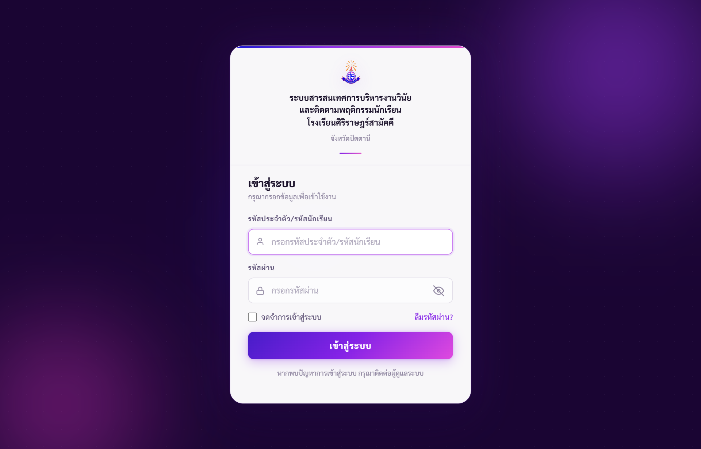
**ภาพที่ 1** หน้าจอแสดงผลการเข้าสู่ระบบ

**คำอธิบายขั้นตอนการทำงาน:**
จากภาพที่ 1 ผู้ใช้งานทุกกลุ่มทำการกรอกข้อมูลเข้าสู่ระบบดังนี้:
1. ป้อน **ชื่อผู้ใช้ (Username)** ลงในช่องชื่อผู้ใช้
2. ป้อน **รหัสผ่าน (Password)** ลงในช่องรหัสผ่าน
3. คลิกปุ่ม **[ เข้าสู่ระบบ ]** เพื่อเข้าใช้งาน
4. เมื่อเข้าสู่ระบบสำเร็จ ระบบจะทำการตรวจสอบสิทธิ์ของผู้ใช้งาน และนำทางไปยังหน้าแดชบอร์ดของแต่ละกลุ่มโดยอัตโนมัติ  
*(หมายเหตุ: กรณีผู้ใช้มีหลายบทบาท ระบบจะแสดงหน้าต่างให้เลือกบทบาทที่ต้องการเข้าใช้งานก่อน)*

---

# 1. กลุ่มของผู้ดูแลระบบ (Admin)

### 1.1) หน้าแดชบอร์ดผู้ดูแลระบบ (Admin Dashboard)

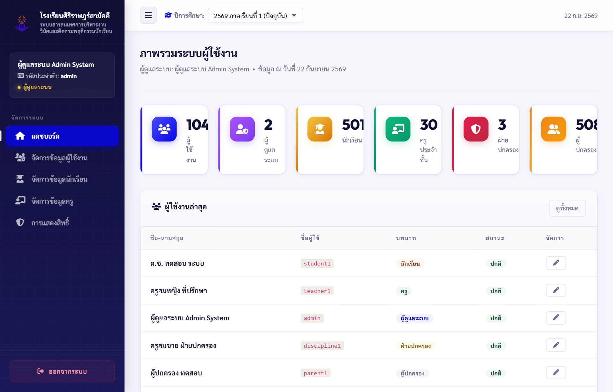
**ภาพที่ 2** หน้าแดชบอร์ดสำหรับผู้ดูแลระบบ

**คำอธิบายขั้นตอนการทำงาน:**
จากภาพที่ 2 ผู้ดูแลระบบสามารถตรวจสอบภาพรวมของระบบทั้งหมด ได้แก่:
* การแสดงการ์ดสรุปยอดรวม: จำนวนนักเรียนทั้งหมด, จำนวนครู, จำนวนผู้ปกครอง และสถิติการใช้งาน
* การเลือกเปลี่ยน **ปีการศึกษา/ภาคเรียนปัจจุบัน** ผ่านแถบเมนูด้านบน
* แถบเมนูด้านซ้าย (Sidebar) สำหรับเข้าถึงฟังก์ชันการจัดการส่วนต่าง ๆ

---

### 1.2) การจัดการข้อมูลผู้ใช้งานระบบ (User Management)

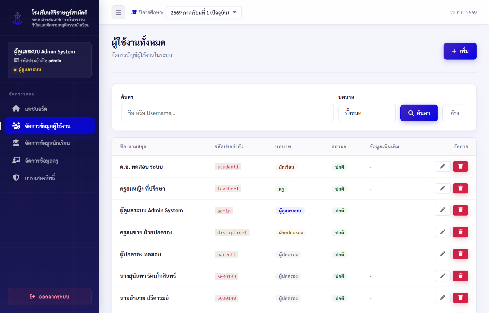
**ภาพที่ 3** หน้าจอแสดงรายการข้อมูลผู้ใช้งาน

**คำอธิบายขั้นตอนการทำงาน:**
จากภาพที่ 3 ผู้ดูแลระบบสามารถจัดการผู้ใช้งานในระบบได้ดังนี้:
* คลิกปุ่ม **[ + เพิ่มผู้ใช้งาน ]** เพื่อสร้างบัญชีผู้ใช้งานใหม่
* ช่องค้นหาและตัวกรองบทบาท สำหรับค้นหาผู้ใช้ตามชื่อ นามสกุล หรือกลุ่มผู้ใช้
* คลิกปุ่ม **[ แก้ไข (ไอคอนดินสอ) ]** เพื่อแก้ไขข้อมูลส่วนตัว หรือรีเซ็ตรหัสผ่าน
* คลิกปุ่ม **[ ลบ (ไอคอนถังขยะ) ]** เพื่อปิดการใช้งานหรือลบบัญชีผู้ใช้ออกจากระบบ

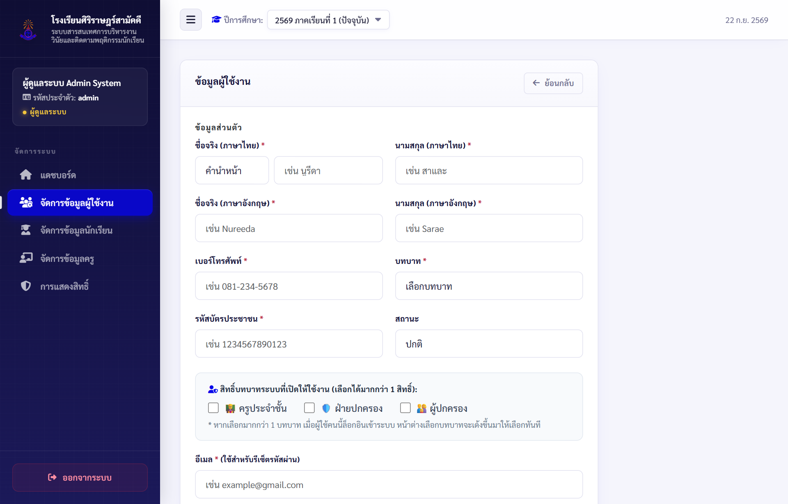
**ภาพที่ 4** หน้าจอแบบฟอร์มเพิ่มข้อมูลผู้ใช้งาน

**คำอธิบายขั้นตอนการทำงาน:**
จากภาพที่ 4 ผู้ดูแลระบบทำการกรอกข้อมูลในแบบฟอร์ม:
1. เลือกบทบาทผู้ใช้งาน (Role)
2. ป้อนชื่อ-นามสกุล, เลขประจำตัวประชาชน, เบอร์โทรศัพท์ และอีเมล
3. กำหนดชื่อผู้ใช้ (Username) และรหัสผ่าน (Password)
4. คลิกปุ่ม **[ บันทึก ]** เพื่อยืนยันการบันทึกข้อมูล หรือคลิกปุ่ม **[ ยกเลิก ]** เพื่อปิดแบบฟอร์ม

---

### 1.3) การจัดการข้อมูลนักเรียน (Student Management)

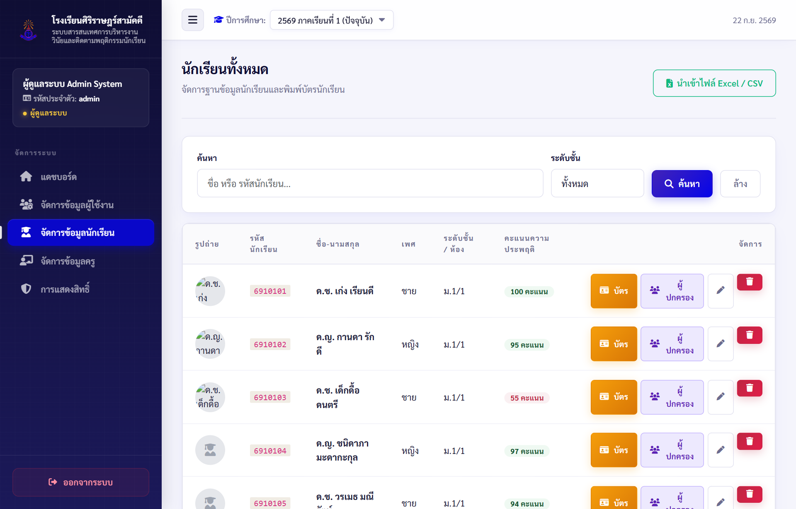
**ภาพที่ 5** หน้าจอแสดงรายการข้อมูลนักเรียน

**คำอธิบายขั้นตอนการทำงาน:**
จากภาพที่ 5 ผู้ดูแลระบบสามารถจัดการข้อมูลนักเรียน:
* ค้นหาและกรองข้อมูลตามระดับชั้น เช่น ม.1, ม.2 หรือตามห้องเรียน
* คลิกปุ่ม **[ บัตรนักเรียน ]** เพื่อสร้างและพิมพ์บัตรประจำตัวนักเรียน
* คลิกปุ่ม **[ ผูกผู้ปกครอง ]** เพื่อจัดการข้อมูลผู้ปกครองของนักเรียนรายบุคคล
* คลิกปุ่ม **[ นำเข้าข้อมูล ]** เพื่อนำเข้าข้อมูลนักเรียนจำนวนมากผ่านไฟล์ Excel

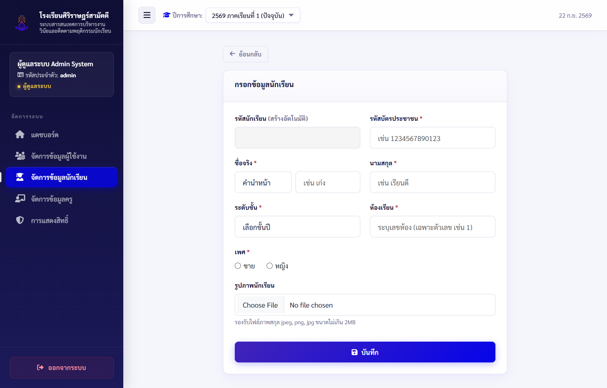
**ภาพที่ 6** หน้าจอแบบฟอร์มเพิ่มข้อมูลนักเรียน

**คำอธิบายขั้นตอนการทำงาน:**
จากภาพที่ 6 กรอกรหัสประจำตัวนักเรียน, เลขประจำตัวประชาชน, คำนำหน้า, ชื่อ-นามสกุล, ระดับชั้น และห้องเรียน จากนั้นคลิกปุ่ม **[ บันทึก ]**

---

### 1.4) การพิมพ์บัตรประจำตัวนักเรียนและ QR Code

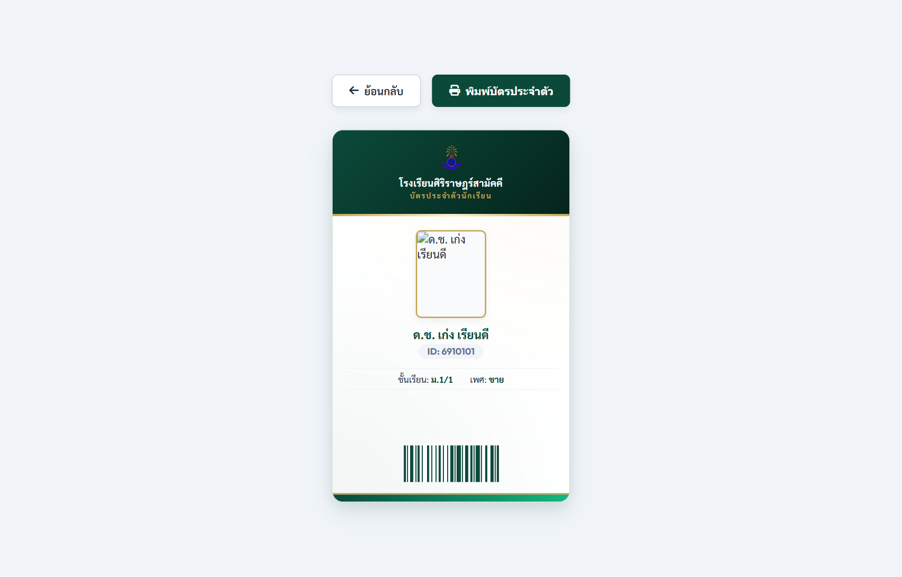
**ภาพที่ 7** หน้าจอแสดงบัตรประจำตัวนักเรียนและ QR Code

**คำอธิบายขั้นตอนการทำงาน:**
จากภาพที่ 7 ระบบจะประมวลผลสร้างบัตรประจำตัวนักเรียนที่มีรูปถ่ายและ **QR Code ประจำตัว** ที่ผูกกับรหัสนักเรียน เพื่อนำไปใช้สแกนเช็คชื่อละหมาดและเข้าแถว สามารถคลิกปุ่ม **[ พิมพ์บัตรประจำตัว ]** เพื่อสั่งพิมพ์ออกทางเครื่องพิมพ์ได้ทันที

---

### 1.5) การนำเข้าข้อมูลนักเรียนจากไฟล์ Excel/CSV

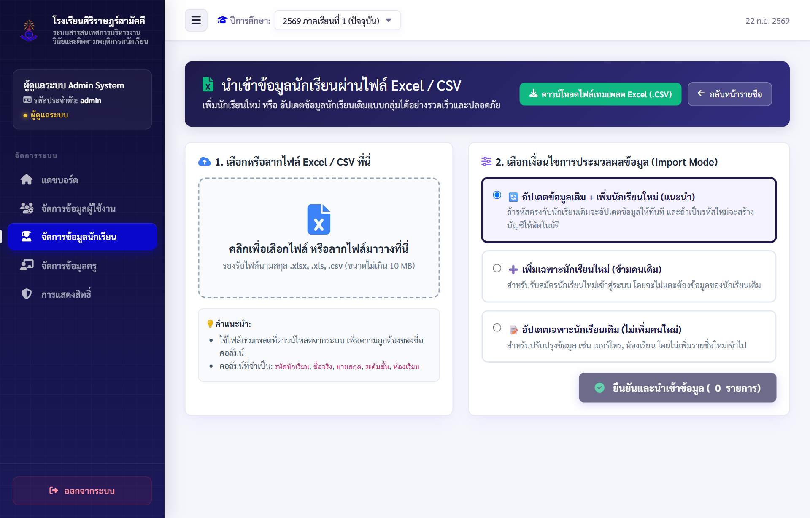
**ภาพที่ 8** หน้าจอนำเข้าข้อมูลนักเรียนผ่านไฟล์ Excel

**คำอธิบายขั้นตอนการทำงาน:**
จากภาพที่ 8 ผู้ดูแลระบบสามารถดำเนินการได้ดังนี้:
1. คลิกปุ่ม **[ ดาวน์โหลดไฟล์แม่แบบ (Template) ]** เพื่อนำโครงสร้างตารางไปกรอกรายชื่อนักเรียน
2. แนบไฟล์ Excel (.xlsx หรือ .csv) ที่เตรียมไว้
3. คลิกปุ่ม **[ อัปโหลดและนำเข้าข้อมูล ]** ระบบจะสร้างบัญชีนักเรียนและข้อมูลห้องเรียนให้โดยอัตโนมัติ

---

### 1.6) การจัดการข้อมูลผู้ปกครอง (Parent / Guardian)

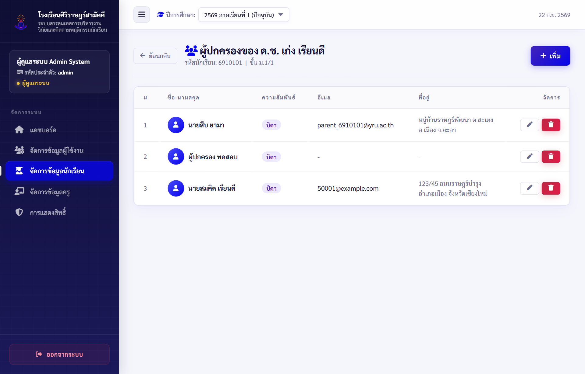
**ภาพที่ 9** หน้าจอจัดการข้อมูลผู้ปกครองและเชื่อมโยงบุตรหลาน

**คำอธิบายขั้นตอนการทำงาน:**
จากภาพที่ 9 ผู้ดูแลระบบสามารถเพิ่มหรือแก้ไขข้อมูลผู้ปกครอง ระบุความสัมพันธ์ (บิดา, มารดา, ผู้ปกครอง) และผูกข้อมูลเข้ากับรหัสนักเรียน เพื่อให้ผู้ปกครองสามารถล็อกอินเข้าสู่ระบบมาติดตามพฤติกรรมบุตรหลานได้

---

### 1.7) การจัดการข้อมูลครูและครูที่ปรึกษา (Teacher Management)

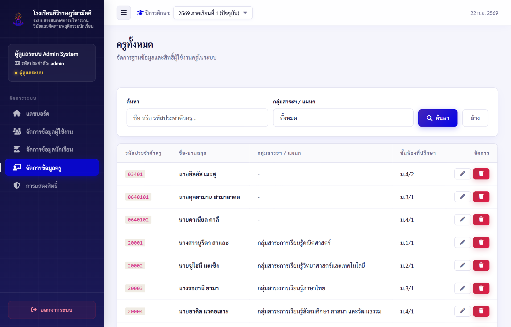
**ภาพที่ 10** หน้าจอแสดงรายการข้อมูลครูและห้องเรียนประจำชั้น

**คำอธิบายขั้นตอนการทำงาน:**
จากภาพที่ 10 ผู้ดูแลระบบสามารถเพิ่มรายชื่อครู, กำหนดวิชาสอน และกำหนด **ห้องเรียนที่ปรึกษา (Advisory Class)** เช่น ผูกครูเข้ากับห้อง ม.3/1 เพื่อให้ครูมีสิทธิ์เช็คชื่อและดูแลนักเรียนประจำห้องนั้น ๆ

---

### 1.8) การแสดงสิทธิ์การเข้าถึงโมดูลของแต่ละบทบาท (Role & Permissions)

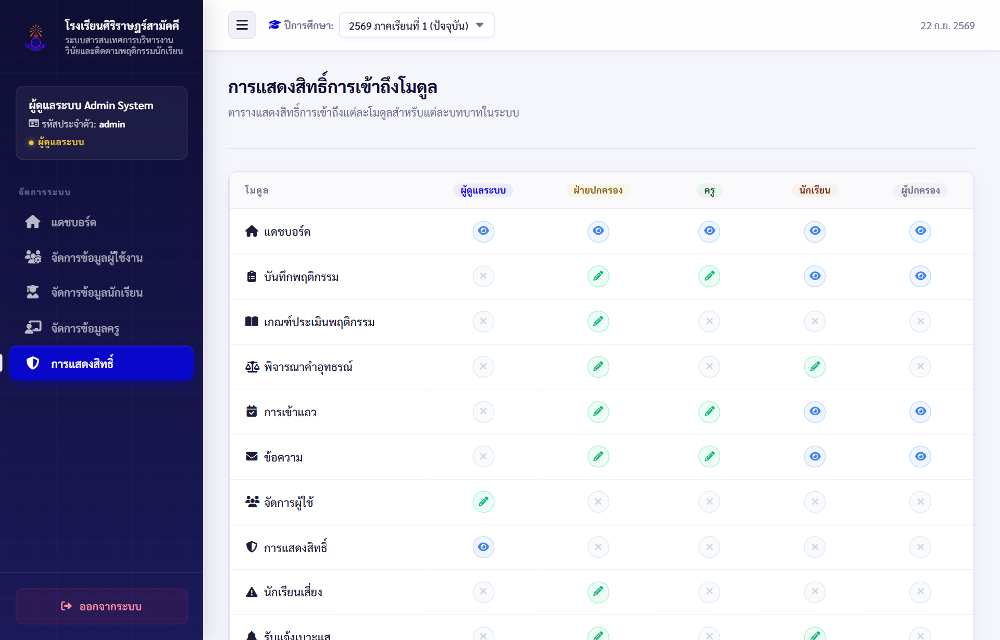
**ภาพที่ 11** หน้าจอตารางแสดงสิทธิ์การเข้าถึงโมดูลของแต่ละบทบาท

**คำอธิบายขั้นตอนการทำงาน:**
จากภาพที่ 11 หน้าจอแสดงตารางสิทธิ์การเข้าถึงแต่ละโมดูลในระบบ (Permission Matrix) สำหรับแต่ละบทบาท ได้แก่ ผู้ดูแลระบบ, ฝ่ายปกครอง, ครู, นักเรียน และผู้ปกครอง โดยระบบจะแสดงสัญลักษณ์สิทธิ์การอ่าน/ดูข้อมูล (รูปตา), สิทธิ์การบันทึกหรือจัดการข้อมูล (รูปดินสอ) และไม่อนุญาตให้เข้าถึง (เครื่องหมายกากบาท) เพื่อให้ผู้ดูแลระบบตรวจสอบความถูกต้องของโครงสร้างสิทธิ์ในระบบได้อย่างชัดเจน

---

# 2. กลุ่มของฝ่ายปกครอง (Discipline Officer)

### 2.1) หน้าแดชบอร์ดฝ่ายปกครอง (Discipline Dashboard)

**ภาพที่ 12** หน้าแดชบอร์ดฝ่ายปกครอง

**คำอธิบายขั้นตอนการทำงาน:**
จากภาพที่ 12 ฝ่ายปกครองสามารถดูสรุปจำนวนการบันทึกพฤติกรรมที่รอตรวจสอบ, คำร้องอุทธรณ์ที่รอดำเนินการ, กราฟสรุปหมวดหมู่ความผิดที่พบบ่อย และยอดนักเรียนกลุ่มเสี่ยง

---

### 2.2) หน้ารายชื่อนักเรียนกลุ่มเสี่ยง (Risk Students Monitor)

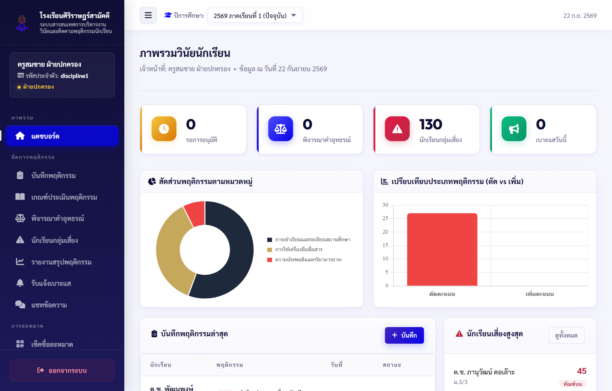
**ภาพที่ 13** หน้าจอติดตามนักเรียนกลุ่มเสี่ยง (Risk Students)

**คำอธิบายขั้นตอนการทำงาน:**
จากภาพที่ 13 ระบบจะคัดกรองนักเรียนที่มีคะแนนพฤติกรรมคงเหลือต่ำกว่าเกณฑ์มาตรฐาน (เช่น ต่ำกว่า 50 คะแนน หรือต่ำกว่า 30 คะแนน) พร้อมระดับเตือนภัยสีเหลือง/แดง เพื่อให้ฝ่ายปกครองดำเนินการออกหนังสือเตือนหรือเชิญผู้ปกครองมารับทราบ

---

### 2.3) การตั้งค่าเกณฑ์กฎระเบียบคะแนนพฤติกรรม (Behavior Rules)

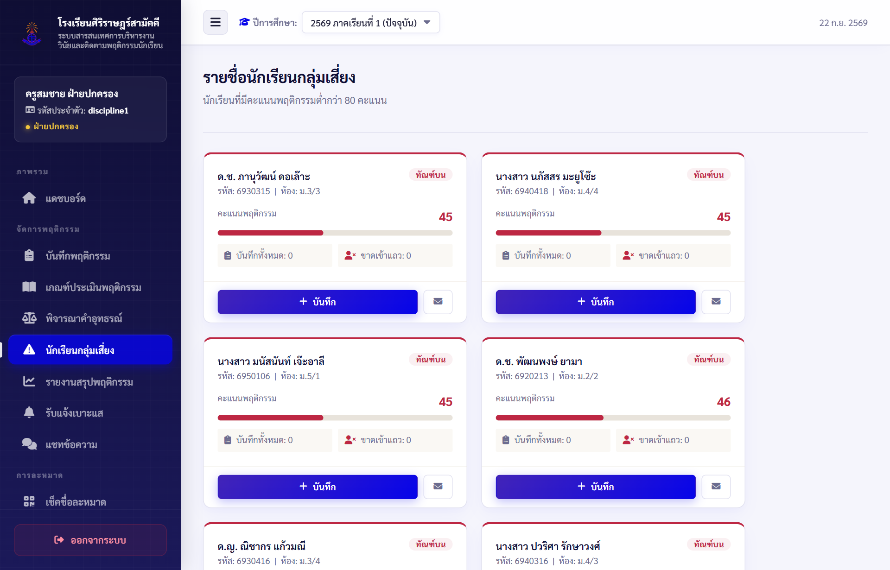
**ภาพที่ 14** หน้าจอแสดงรายการเกณฑ์กฎระเบียบวินัย

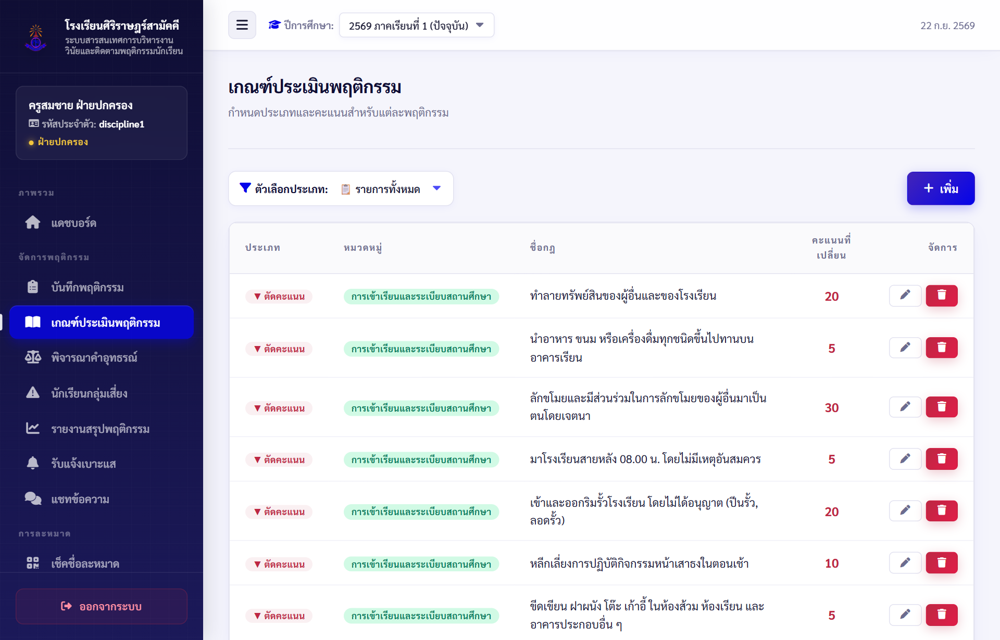
**ภาพที่ 15** หน้าจอแบบฟอร์มเพิ่มกฎระเบียบและคะแนน

**คำอธิบายขั้นตอนการทำงาน:**
จากภาพที่ 14 และ 15 ฝ่ายปกครองสามารถกำหนดข้อระเบียบของโรงเรียน:
1. คลิกปุ่ม **[ + เพิ่มกฎระเบียบ ]**
2. กรอกชื่อข้อระเบียบ (เช่น หนีเรียน, มาสาย, แต่งกายผิดระเบียบ, ช่วยเหลืองานโรงเรียน)
3. เลือกประเภท: **หักคะแนนความประพฤติ (-)** หรือ **เพิ่มคะแนนความดี (+)**
4. ระบุจำนวนคะแนน (เช่น -5, -10, +10)
5. คลิกปุ่ม **[ บันทึกเกณฑ์ ]**

---

### 2.4) การตรวจสอบและอนุมัติการบันทึกพฤติกรรม (Approve Records)

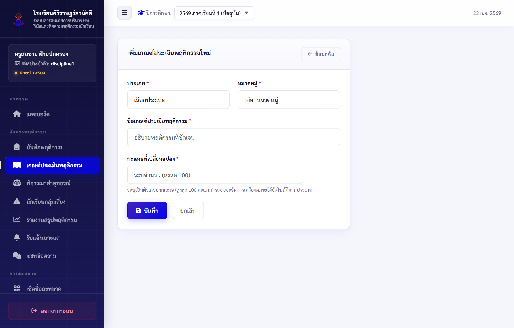
**ภาพที่ 16** หน้าจอตรวจสอบและอนุมัติบันทึกพฤติกรรม

**คำอธิบายขั้นตอนการทำงาน:**
จากภาพที่ 16 เมื่อครูส่งเรื่องบันทึกพฤติกรรมเข้ามา ฝ่ายปกครองจะตรวจสอบ:
* คลิกปุ่ม **[ ตรวจสอบ/ดูรายละเอียด ]** เพื่อดูรูปถ่ายหลักฐานและคำชี้แจง
* คลิกปุ่ม **[ อนุมัติ (Approve) ]** เพื่อยืนยันการตัดหรือเพิ่มคะแนนนักเรียนอย่างเป็นทางการ
* คลิกปุ่ม **[ ปฏิเสธ (Reject) ]** เพื่อยกเลิกบันทึกดังกล่าวพร้อมระบุเหตุผล

---

### 2.5) การพิจารณาคำร้องขออุทธรณ์คะแนน (Review Appeals)

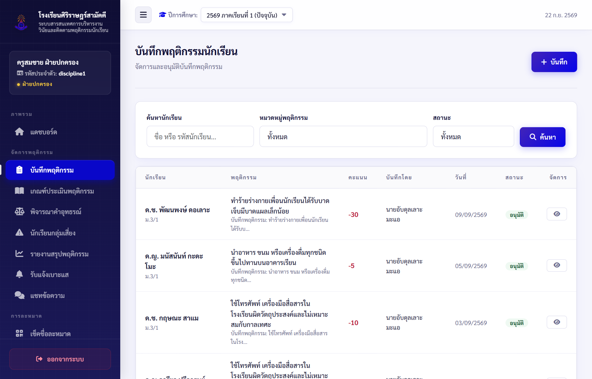
**ภาพที่ 17** หน้าจอพิจารณาคำร้องอุทธรณ์คะแนน

**คำอธิบายขั้นตอนการทำงาน:**
จากภาพที่ 17 ฝ่ายปกครองตรวจสอบเรื่องอุทธรณ์ที่นักเรียนส่งเข้ามา:
1. ตรวจดูเหตุผลคำร้อง และเอกสารประกอบ เช่น ใบรับรองแพทย์ หรือหนังสือรับรอง
2. เลือกผลการพิจารณา:
   * คลิกปุ่ม **[ อนุมัติการอุทธรณ์ ]** : ระบบจะทำการคืนคะแนนความประพฤติให้นักเรียนโดยอัตโนมัติ
   * คลิกปุ่ม **[ ปฏิเสธคำร้อง ]** : คงการตัดคะแนนตามเดิม

---

### 2.6) การจัดการเรื่องแจ้งเบาะแสพฤติกรรม (Informant Reports)

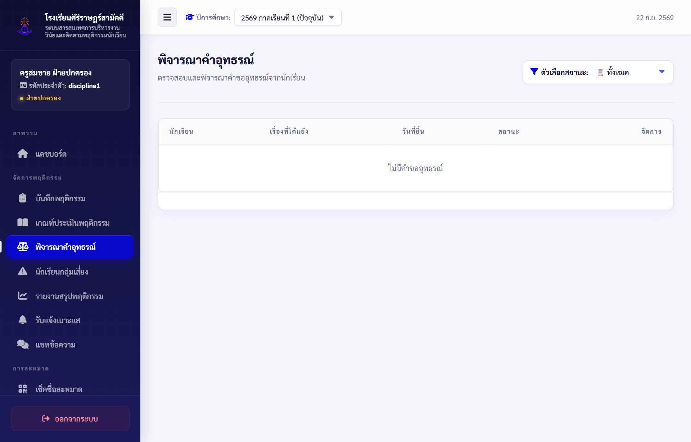
**ภาพที่ 18** หน้าจอรายการแจ้งเบาะแสพฤติกรรม

**คำอธิบายขั้นตอนการทำงาน:**
จากภาพที่ 18 ฝ่ายปกครองเปิดดูเรื่องที่นักเรียนส่งแจ้งเบาะแส (เช่น พฤติกรรมสูบบุหรี่ หรือชู้สาว) สามารถรับเรื่องไปตรวจสอบ บันทึกผล และคลิกปุ่ม **[ รับเรื่อง ]** หรือ **[ ปิดเรื่อง / จัดเก็บ (Archive) ]**

---

### 2.7) หน้ารายงานสรุปพฤติกรรมและการส่งออกข้อมูล (Reports & Export)

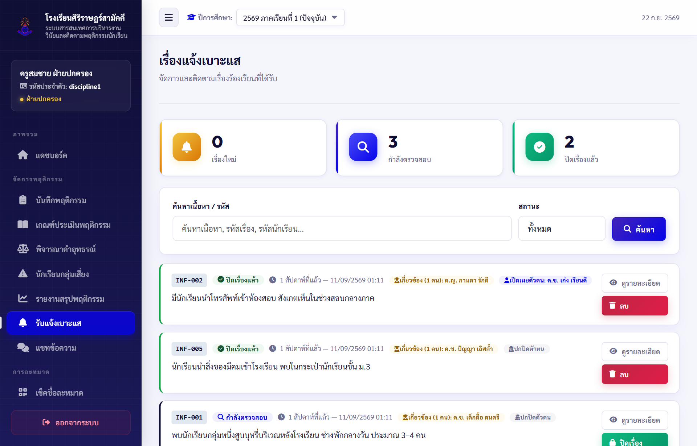
**ภาพที่ 19** หน้าจอรายงานสรุปพฤติกรรมและการส่งออกข้อมูล

**คำอธิบายขั้นตอนการทำงาน:**
จากภาพที่ 19 ฝ่ายปกครองสามารถเลือกเงื่อนไขรายงาน:
* เลือกช่วงวันที่เริ่มต้น - สิ้นสุด, เลือกระดับชั้น หรือห้องเรียน
* คลิกปุ่ม **[ พิมพ์รายงาน PDF ]** เพื่อจัดพิมพ์รายงานประจำห้อง
* คลิกปุ่ม **[ ส่งออก Excel ]** เพื่อนำข้อมูลไปวิเคราะห์สถิติต่อไป

---

# 3. กลุ่มของครูผู้สอนและครูที่ปรึกษา (Teacher)

### 3.1) หน้าแดชบอร์ดครูและข้อมูลห้องเรียนที่ปรึกษา (My Classroom)

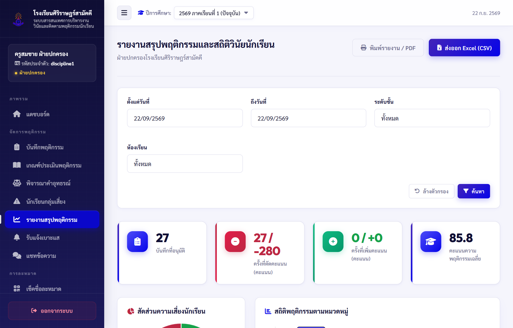
**ภาพที่ 20** หน้าแดชบอร์ดครูและห้องเรียนที่รับผิดชอบ

**คำอธิบายขั้นตอนการทำงาน:**
จากภาพที่ 20 ครูที่ปรึกษาสามารถตรวจสอบสถิติคะแนนเฉลี่ยของห้องตนเอง ดูรายชื่อนักเรียนที่มีความเสี่ยงคะแนนต่ำ และเข้าสู่เมนูด่วนเพื่อเช็คชื่อประจำวัน

---

### 3.2) การบันทึกเวลาเรียนและการเช็คชื่อประจำวัน (Daily Attendance)

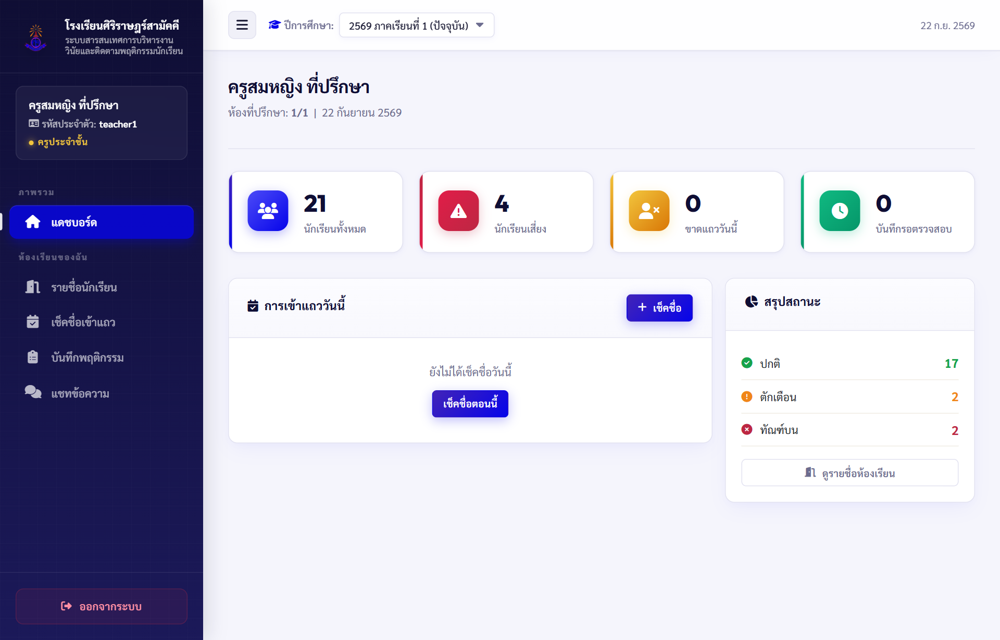
**ภาพที่ 21** หน้าจอเช็คชื่อการเข้าเรียนประจำวัน

**คำอธิบายขั้นตอนการทำงาน:**
จากภาพที่ 21 ครูทำการเช็คชื่อนักเรียน:
1. เลือกระดับชั้นและห้องเรียนประจำวัน
2. คลิกเลือกสถานะของนักเรียนแต่ละคน: **[มา] [สาย] [ขาด] [ลา]**
3. มีปุ่มลัด **[ มาทั้งหมด ]** เพื่อความสะดวกและรวดเร็ว
4. คลิกปุ่ม **[ บันทึกการเช็คชื่อ ]**

---

### 3.3) การบันทึกคะแนนพฤติกรรมนักเรียน (Log Behavior Record)

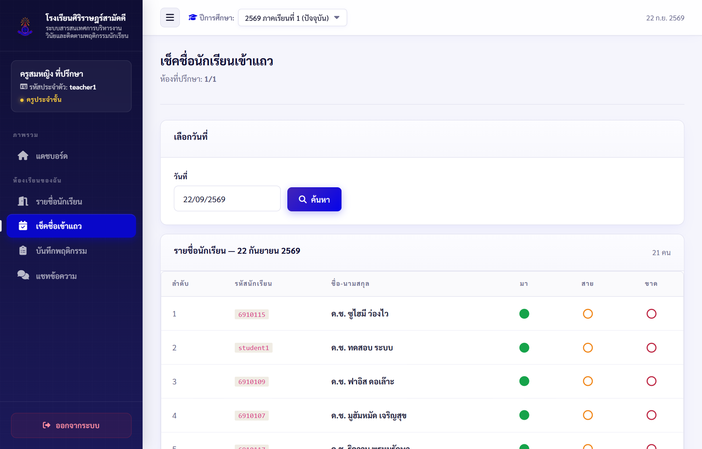
**ภาพที่ 22** หน้าจอแบบฟอร์มบันทึกพฤติกรรมนักเรียน

**คำอธิบายขั้นตอนการทำงาน:**
จากภาพที่ 22 เมื่อพบน้องนักเรียนกระทำผิดระเบียบหรือทำความดี:
1. ค้นหาและเลือกรหัสนักเรียน หรือชื่อนักเรียน
2. เลือกกฎระเบียบความประพฤติที่เกี่ยวข้อง
3. ระบุสถานที่ รายละเอียดเหตุการณ์ และแนบรูปภาพหลักฐาน (ถ้ามี)
4. คลิกปุ่ม **[ ส่งบันทึก ]** เรื่องจะถูกส่งไปยังฝ่ายปกครองเพื่อรอการอนุมัติต่อไป

---

### 3.4) การสแกนเช็คชื่อละหมาด (Prayer Scanner)

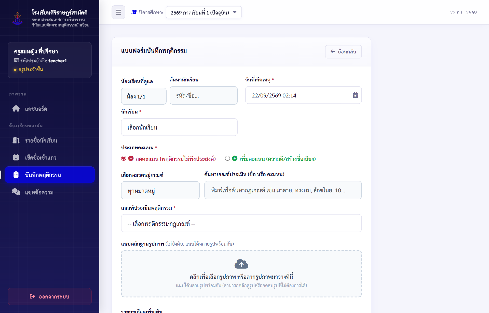
**ภาพที่ 23** หน้าจอเครื่องสแกน QR Code สำหรับเช็คชื่อละหมาด

**คำอธิบายขั้นตอนการทำงาน:**
จากภาพที่ 23 ครูหรือเจ้าหน้าที่เปิดหน้านี้ผ่านโทรศัพท์มือถือหรือแท็บเล็ต:
1. เลือกรอบเวลาละหมาด (เช่น ซุฮรี, อัศรี)
2. นำกล้องไปสแกน **QR Code** บนบัตรนักเรียน หรือหน้าจอมือถือของนักเรียน
3. ระบบจะแสดงเสียงและเครื่องหมายถูกสีเขียว พร้อมชื่อ-นามสกุลนักเรียนทันที

---

### 3.5) ระบบกล่องข้อความติดต่อสื่อสาร (Teacher Messages)

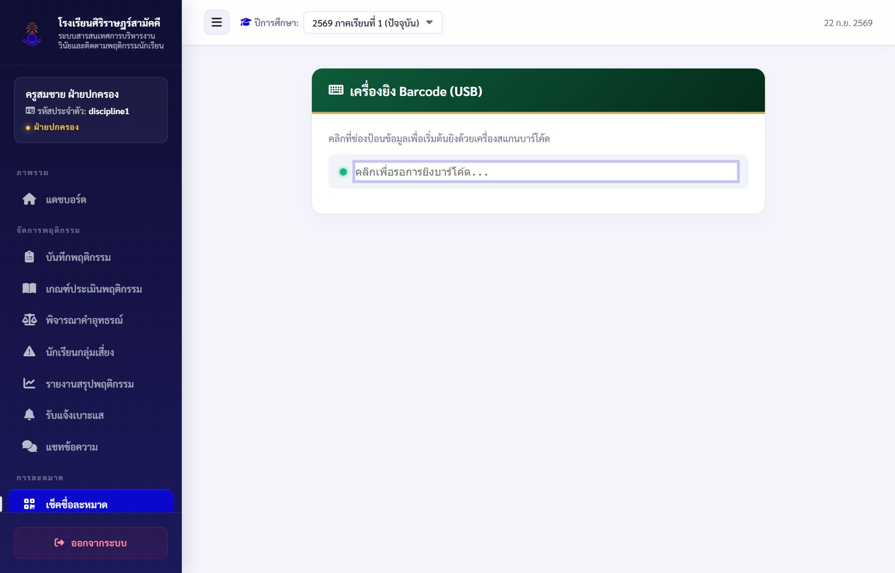
**ภาพที่ 24** หน้าจอกล่องข้อความติดต่อสื่อสาร

**คำอธิบายขั้นตอนการทำงาน:**
จากภาพที่ 24 ครูสามารถรับและตอบข้อความแชทจากผู้ปกครองของนักเรียนในห้องที่ปรึกษา ตรวจดูเอกสารใบลาที่แนบมา และชี้แจงพฤติกรรมของนักเรียน

---

# 4. กลุ่มของนักเรียน (Student)

### 4.1) หน้าแดชบอร์ดนักเรียนและคะแนนพฤติกรรมคงเหลือ (Student Dashboard)

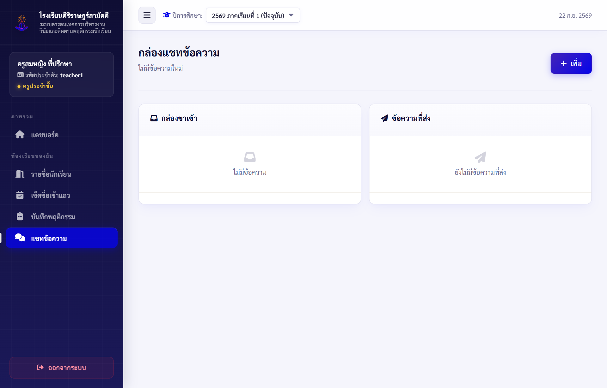
**ภาพที่ 25** หน้าแดชบอร์ดแสดงคะแนนความประพฤตินักเรียน

**คำอธิบายขั้นตอนการทำงาน:**
จากภาพที่ 25 นักเรียนสามารถดู:
* คะแนนพฤติกรรมคงเหลือ (เต็ม 100 คะแนน) พร้อมมาตรวัดระดับสีเขียว/เหลือง/แดง
* ประวัติการถูกตัดคะแนนล่าสุด และสถานะการเข้าแถว/เข้าเรียน

---

### 4.2) การตรวจสอบประวัติและสถิติการเข้าแถว (Student Attendance)

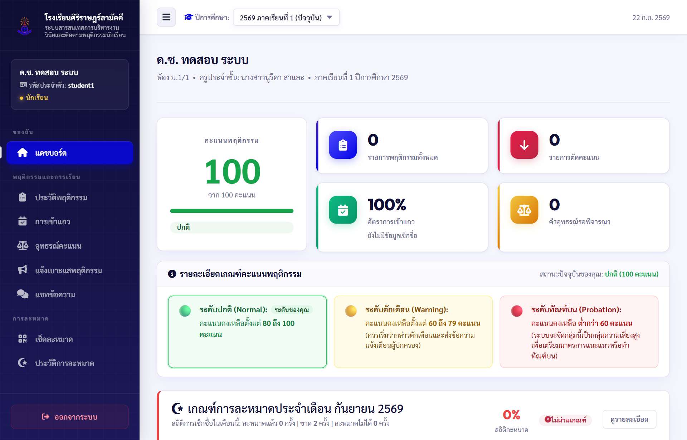
**ภาพที่ 26** หน้าจอปฏิทินและสถิติการเข้าแถวของนักเรียน

**คำอธิบายขั้นตอนการทำงาน:**
จากภาพที่ 26 นักเรียนสามารถติดตามข้อมูลการมาเรียนและการเข้าแถวของตนเองได้อย่างละเอียด:
1. ดูสถิติสรุปภาพรวมรายเดือน ได้แก่ จำนวนครั้งที่ **เข้าแถว**, **มาสาย** และ **ขาดเข้าแถว** พร้อมเปอร์เซ็นต์ความสม่ำเสมอ
2. ตรวจสอบสถานะการเข้าแถวบน **ปฏิทินประจำเดือน** โดยระบบจะแสดงสถานะแต่ละวันอย่างชัดเจน
3. ตรวจสอบ **เกณฑ์วินัยการตัดคะแนนความประพฤติอัตโนมัติ** (ขาดเข้าแถวสะสมครบทุก 3 ครั้ง ตัด 5 คะแนน โดยมาสาย 3 ครั้งเทียบเท่าขาด 1 ครั้ง)
4. คลิกปุ่ม **[ สรุปสถิติแต่ละเดือน (ร้อยละ %) ]** เพื่อเปิดหน้าต่างดูรายงานสถิติการเข้าแถวแบบแยกตามรายเดือนตลอดทั้งภาคเรียน

---

### 4.3) การยื่นคำร้องขออุทธรณ์คะแนน (Submit Appeal)

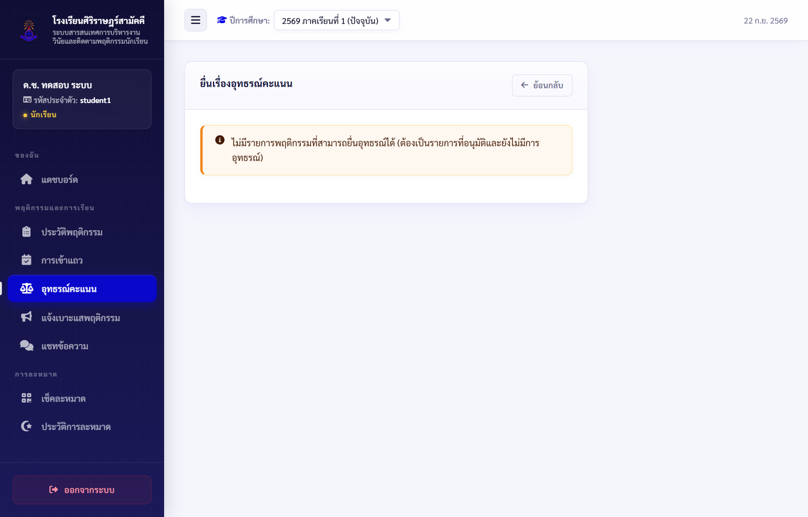
**ภาพที่ 27** หน้าจอแบบฟอร์มยื่นคำร้องขออุทธรณ์คะแนน

**คำอธิบายขั้นตอนการทำงาน:**
จากภาพที่ 27 หากนักเรียนถูกตัดคะแนนโดยมีเหตุจำเป็น:
1. เลือกรายการบันทึกพฤติกรรมที่ต้องการอุทธรณ์
2. กรอกข้อความชี้แจงเหตุผลและข้อเท็จจริง
3. อัปโหลดรูปภาพหลักฐาน เช่น ใบรับรองแพทย์ หรือใบมอบหมายงาน
4. คลิกปุ่ม **[ ส่งคำร้องอุทธรณ์ ]** และรอผลการพิจารณาจากฝ่ายปกครอง

---

### 4.4) การเปิดบัตร QR Code ประจำตัวเพื่อเช็คชื่อละหมาด (Prayer QR Check-in)

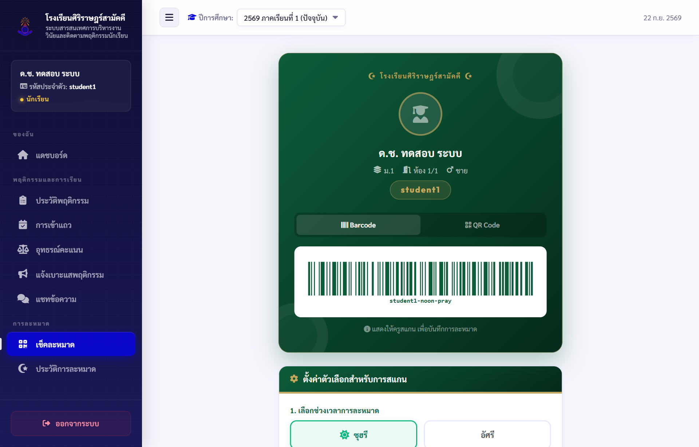
**ภาพที่ 28** หน้าจอแสดง QR Code ประจำตัวสำหรับเช็คชื่อละหมาด

**คำอธิบายขั้นตอนการทำงาน:**
จากภาพที่ 28 นักเรียนเปิดหน้านี้ผ่านโทรศัพท์มือถือ เพื่อแสดง QR Code ประจำตัวให้ครูสแกน ณ จุดเช็คชื่อละหมาด พร้อมทั้งสามารถดูประวัติการเช็คชื่อละหมาดของวันนี้ได้ทันที

---

### 4.5) การส่งเรื่องแจ้งเบาะแสพฤติกรรม (Informant Report)

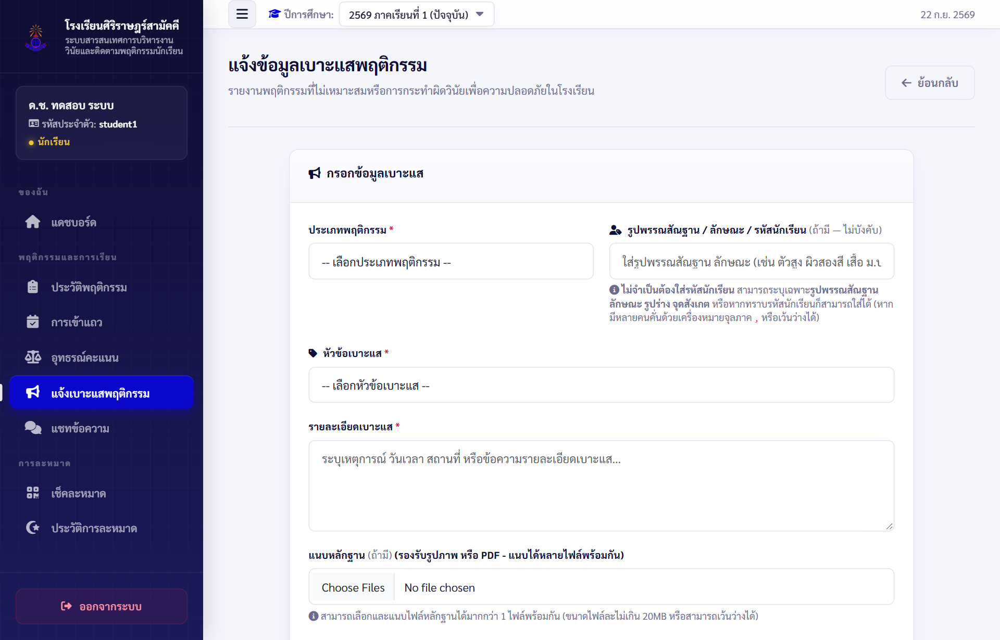
**ภาพที่ 29** หน้าจอแจ้งเบาะแสพฤติกรรมที่ไม่เหมาะสม

**คำอธิบายขั้นตอนการทำงาน:**
จากภาพที่ 29 นักเรียนสามารถร่วมดูแลความปลอดภัยในโรงเรียน:
1. กรอกรายละเอียดเหตุการณ์ วันที่ และสถานที่
2. เลือกว่าจะ **"เปิดเผยชื่อผู้แจ้ง"** หรือ **"แจ้งแบบปกปิดชื่อ (Anonymous)"** เพื่อความปลอดภัย
3. คลิกปุ่ม **[ ส่งรายงานเบาะแส ]** เรื่องจะส่งตรงไปยังฝ่ายปกครองโดยเฉพาะ

---

# 5. กลุ่มของผู้ปกครอง (Parent / Guardian)

### 5.1) หน้าแดชบอร์ดผู้ปกครองและการสลับดูข้อมูลบุตรหลาน

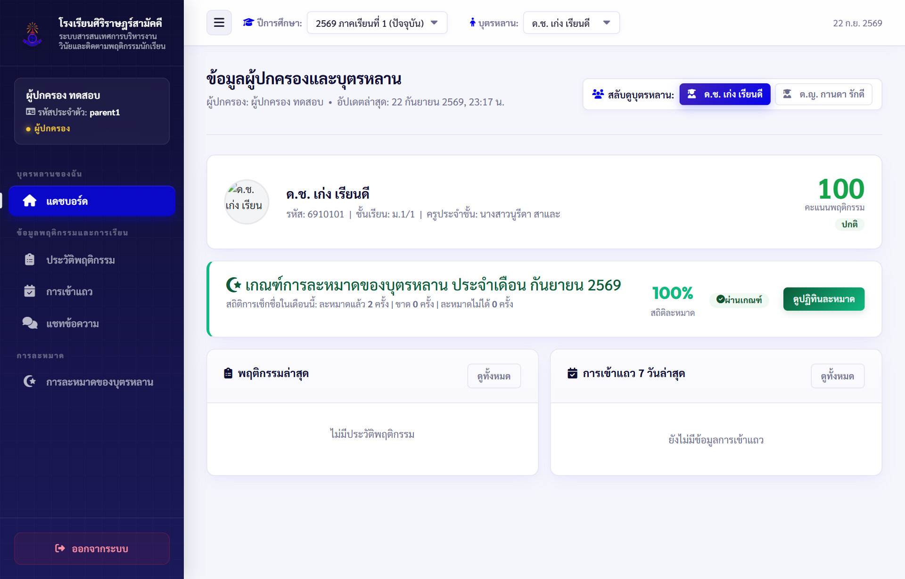
**ภาพที่ 30** หน้าแดชบอร์ดผู้ปกครอง

**คำอธิบายขั้นตอนการทำงาน:**
จากภาพที่ 30 ผู้ปกครองดูภาพรวมความประพฤติของบุตรหลาน:
* แสดงคะแนนความประพฤติคงเหลือของบุตรหลาน
* กรณีมีบุตรหลานเรียนอยู่มากกว่า 1 คน สามารถคลิกปุ่ม **[ สลับดูบุตรหลาน ]** เพื่อเลือกดูข้อมูลของแต่ละคนได้อย่างสะดวก

---

### 5.2) การตรวจสอบคะแนนพฤติกรรมและเวลาเรียน

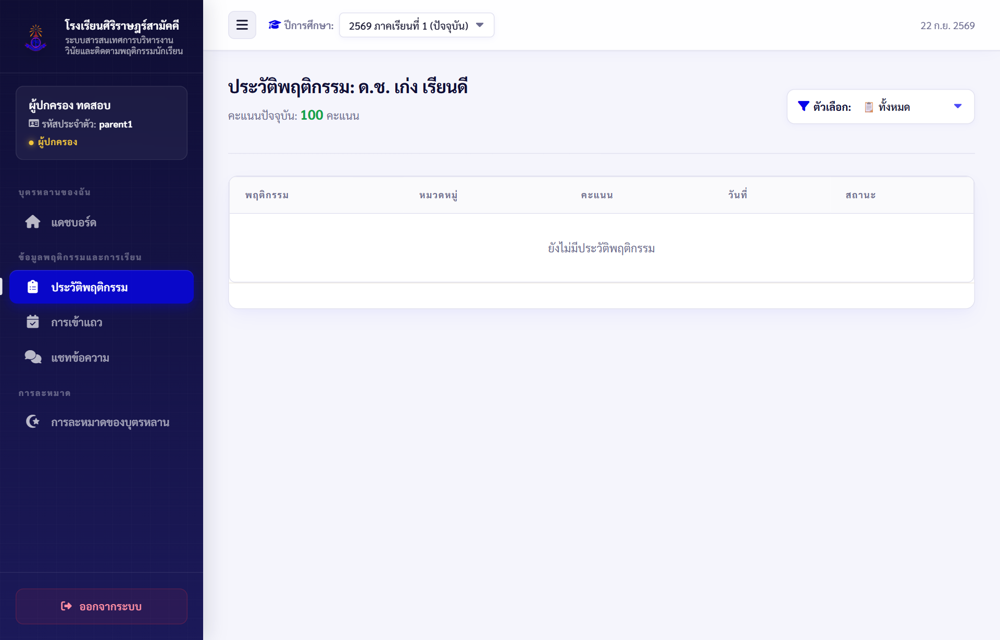
**ภาพที่ 31** หน้าจอประวัติพฤติกรรมและการเช็คชื่อบุตรหลาน

**คำอธิบายขั้นตอนการทำงาน:**
จากภาพที่ 31 แสดงรายละเอียดบันทึกการหักคะแนน ย้อนหลัง สาเหตุ วันที่ และประวัติการขาด-ลา-มาสาย เพื่อให้ผู้ปกครองสามารถติดตามและตักเตือนบุตรหลานได้ทันท่วงที

---

### 5.3) การส่งข้อความติดต่อครูที่ปรึกษา (Parent Messaging)

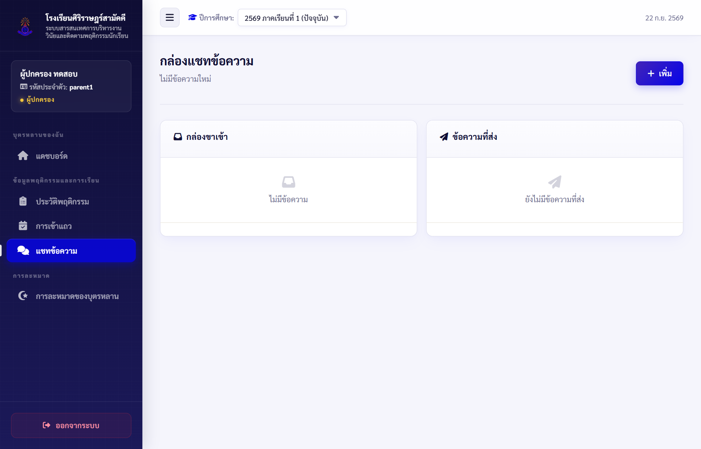
**ภาพที่ 32** หน้าจอส่งข้อความติดต่อครูที่ปรึกษา

**คำอธิบายขั้นตอนการทำงาน:**
จากภาพที่ 32 ผู้ปกครองสามารถพิมพ์ข้อความสอบถามปัญหา หรือแจ้งการลากิจ/ลาป่วย พร้อมแนบเอกสารส่งตรงไปยังครูที่ปรึกษาได้อย่างสะดวกและเป็นส่วนตัว

---

# ภาคผนวก: ตารางสรุปภาพหน้าจอและ URL สำหรับแคปภาพลงเล่ม

| หมายเลขภาพ | รายละเอียดภาพหน้าจอ | หน้าในระบบ (Route / URL) | สิทธิ์ผู้ใช้งาน |
| :---: | :--- | :--- | :---: |
| **ภาพที่ 1** | หน้าจอแสดงผลการเข้าสู่ระบบ (Login) | `/login` | ทุกกลุ่ม |
| **ภาพที่ 2** | หน้าแดชบอร์ดสำหรับผู้ดูแลระบบ | `/admin/dashboard` | ผู้ดูแลระบบ |
| **ภาพที่ 3** | หน้าจอแสดงรายการข้อมูลผู้ใช้งาน | `/admin/users` | ผู้ดูแลระบบ |
| **ภาพที่ 4** | หน้าจอแบบฟอร์มเพิ่มข้อมูลผู้ใช้งาน | `/admin/users/create` | ผู้ดูแลระบบ |
| **ภาพที่ 5** | หน้าจอแสดงรายการข้อมูลนักเรียน | `/admin/students` | ผู้ดูแลระบบ |
| **ภาพที่ 6** | หน้าจอแบบฟอร์มเพิ่มข้อมูลนักเรียน | `/admin/students/create` | ผู้ดูแลระบบ |
| **ภาพที่ 7** | หน้าจอแสดงบัตรประจำตัวนักเรียนและ QR Code | `/admin/students/{id}/card` | ผู้ดูแลระบบ |
| **ภาพที่ 8** | หน้าจอนำเข้าข้อมูลนักเรียนผ่านไฟล์ Excel | `/admin/students/import` | ผู้ดูแลระบบ |
| **ภาพที่ 9** | หน้าจอจัดการข้อมูลผู้ปกครอง | `/admin/students/{id}/parents` | ผู้ดูแลระบบ |
| **ภาพที่ 10** | หน้าจอแสดงรายการข้อมูลครูและห้องเรียน | `/admin/teachers` | ผู้ดูแลระบบ |
| **ภาพที่ 11** | หน้าจอตารางแสดงสิทธิ์การเข้าถึงโมดูล | `/admin/permissions` | ผู้ดูแลระบบ |
| **ภาพที่ 12** | หน้าแดชบอร์ดฝ่ายปกครอง | `/discipline/dashboard` | ฝ่ายปกครอง |
| **ภาพที่ 13** | หน้าจอติดตามนักเรียนกลุ่มเสี่ยง (Risk Students) | `/discipline/risk-students` | ฝ่ายปกครอง |
| **ภาพที่ 14** | หน้าจอแสดงรายการเกณฑ์กฎระเบียบวินัย | `/discipline/behavior-rules` | ฝ่ายปกครอง |
| **ภาพที่ 15** | หน้าจอแบบฟอร์มเพิ่มกฎระเบียบและคะแนน | `/discipline/behavior-rules/create` | ฝ่ายปกครอง |
| **ภาพที่ 16** | หน้าจอตรวจสอบและอนุมัติบันทึกพฤติกรรม | `/discipline/behavior-records` | ฝ่ายปกครอง |
| **ภาพที่ 17** | หน้าจอพิจารณาคำร้องอุทธรณ์คะแนน | `/discipline/appeals` | ฝ่ายปกครอง |
| **ภาพที่ 18** | หน้าจอรายการแจ้งเบาะแสพฤติกรรม | `/discipline/informant-reports` | ฝ่ายปกครอง |
| **ภาพที่ 19** | หน้าจอรายงานสรุปพฤติกรรมและการส่งออกข้อมูล | `/discipline/behavior-report` | ฝ่ายปกครอง |
| **ภาพที่ 20** | หน้าแดชบอร์ดครูและข้อมูลห้องเรียนที่ปรึกษา | `/teacher/dashboard` | ครู |
| **ภาพที่ 21** | หน้าจอเช็คชื่อการเข้าเรียนประจำวัน | `/teacher/attendance` | ครู |
| **ภาพที่ 22** | หน้าจอแบบฟอร์มบันทึกพฤติกรรมนักเรียน | `/teacher/behavior-records/create` | ครู |
| **ภาพที่ 23** | หน้าจอเครื่องสแกน QR Code เช็คชื่อละหมาด | `/prayer/scan` | ครู |
| **ภาพที่ 24** | หน้าจอกล่องข้อความติดต่อสื่อสารของครู | `/teacher/messages` | ครู |
| **ภาพที่ 25** | หน้าแดชบอร์ดแสดงคะแนนความประพฤตินักเรียน | `/student/dashboard` | นักเรียน |
| **ภาพที่ 26** | หน้าจอปฏิทินและสถิติการเข้าแถวของนักเรียน | `/student/attendance` | นักเรียน |
| **ภาพที่ 27** | หน้าจอแบบฟอร์มยื่นคำร้องขออุทธรณ์คะแนน | `/student/appeals/create` | นักเรียน |
| **ภาพที่ 28** | หน้าจอแสดง QR Code ประจำตัวสำหรับเช็คชื่อละหมาด | `/student/prayer-checkin` | นักเรียน |
| **ภาพที่ 29** | หน้าจอแจ้งเบาะแสพฤติกรรมที่ไม่เหมาะสม | `/student/informant-reports/create` | นักเรียน |
| **ภาพที่ 30** | หน้าแดชบอร์ดผู้ปกครองและการสลับบุตรหลาน | `/parent/dashboard` | ผู้ปกครอง |
| **ภาพที่ 31** | หน้าจอประวัติพฤติกรรมและการเช็คชื่อบุตรหลาน | `/parent/behavior-records` | ผู้ปกครอง |
| **ภาพที่ 32** | หน้าจอส่งข้อความติดต่อครูที่ปรึกษา | `/parent/messages` | ผู้ปกครอง |

